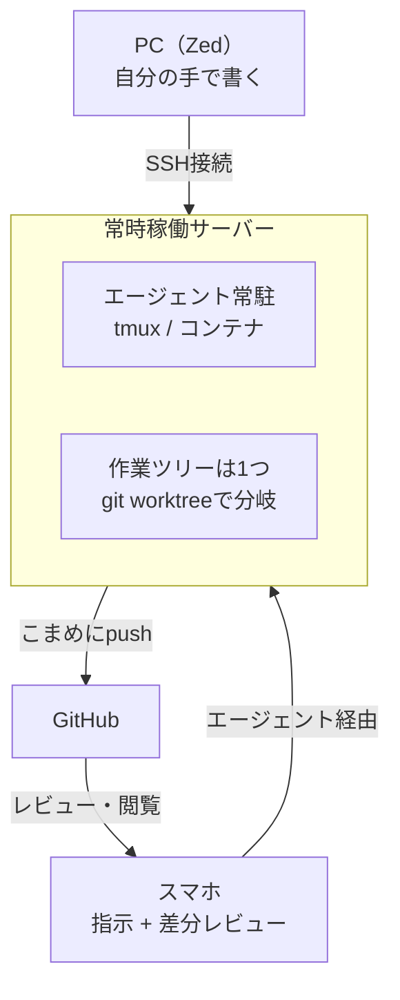

# deskless

移動中もAIエージェントで開発を継続するための、常時稼働サーバー環境の構築記録。

PCの前にいるときしか開発できない状態から抜け出すことが目的。スマホをエディタにするのではなく、**スマホを操縦席にして、実行は常時稼働のサーバーに任せる**。

## 全体像



設計の要点は2つ。

- **ワークスペースを1箇所に絞る** — サーバー上の作業ツリーが唯一の正。PCはSSHでそこを見るだけなので、同期の問題が起きない
- **未コミットのまま放置しない** — こまめにpushしてGitHubに押し出せば、可視化の仕組みを自作せずに済む

詳細は [docs/architecture.md](docs/architecture.md) を参照。
Dockerによる隔離の仕組みと設定は [docs/docker-isolation.md](docs/docker-isolation.md) にまとめている。

## 構成

| 要素 | 選択 |
| --- | --- |
| 常時稼働サーバー | 自宅Windows PC上のWSL2（Ubuntu） |
| プロセス常駐 | tmux（WSL内にネイティブ） |
| 隔離 | Docker Engine（Docker Desktopは使わない） |
| エージェント | Claude Code / Codex（いずれもサブスク） |
| PCからの接続 | Zed Remote Development（SSH / Tailscale） |
| スマホからの接続 | Claudeアプリ「コード」タブ / Codexモバイル |
| レビュー | GitHubモバイル（Draft PR） |

## リポジトリ構成

```
deskless/
├── README.md
├── docs/
│   ├── architecture.md      # 構成の詳細・設計判断の記録
│   └── docker-isolation.md  # Dockerによる隔離の仕組みと設定
├── wsl/                     # wsl.conf / .wslconfig
├── systemd/                 # tmuxセッションとエージェントの自動起動
├── scripts/                 # セットアップ・復帰用スクリプト
└── docker/                  # 開発用コンテナ定義
```

## 進捗

- [ ] **Phase 0** — 手元のMacで、スマホからの指示・レビューが自分に合うか検証
- [ ] **Phase 1** — Draft PRとpushの運用ルールを1リポジトリで確立
- [ ] **Phase 2** — WSL2にサーバー環境を構築
- [ ] **Phase 3** — TailscaleとSSHでPCからの窓口を接続
- [ ] **Phase 4** — 再起動からの自動復帰を作り込む

各フェーズのチェックリストは [導入ステップ](docs/architecture.md#導入ステップ) にある。

## 設計方針

**「落ちない」より「戻る」。**

家庭環境で24時間の連続稼働を保証するのは無理がある（Windows Update、停電など）。連続稼働を目指すのではなく、落ちても勝手に戻る状態を作る。

## 未決事項

- オフライン時（飛行機・地下など）にローカルクローンを許すかどうか
- エージェントの自動承認をどこまで許可するか
- 回線断からの自動復旧をどう実装するか
