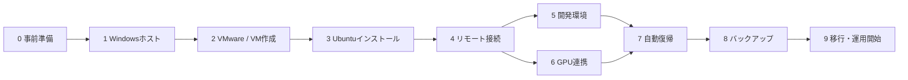

# ロードマップ：自宅PCにUbuntu開発VMを構築する

> 元になる設計: [docs/vmware_ubuntu_dev_vm_architecture.md](docs/vmware_ubuntu_dev_vm_architecture.md)

自宅のWindows 11 Home PC上に VMware Workstation Pro で Ubuntu Server 24.04 LTS のVMを立て、MacBookから Tailscale + SSH で使うメイン開発サーバーにするまでの道筋。

## ゴール

次の状態になったら完成とする。

- 外出先のMacBookから `ssh dev-vm` → `tmux attach -t dev` で作業を再開できる
- **Windowsが再起動しても、誰も触らずにその状態に戻る**
- VM上のコードから、Windows側の Ollama / ComfyUI（RTX 3080）をHTTP APIで呼べる
- VMが壊れても、未コミットの変更までバックアップから取り戻せる

## 既存の計画との関係

README の進捗にある Phase 2〜4 は WSL2 を前提にしている。このロードマップは、そのサーバー部分を **VMware + Ubuntu Server VM で置き換えるもの**。
Phase 0・1（働き方の検証と運用ルール）はサーバーの種類に依存しないため、並行して進めてよい。

---

## 全体の流れ

| Step | 内容 | 完了の目安 |
| --- | --- | --- |
| 0 | 事前準備 | 必要なアカウント・ISO・鍵が揃っている |
| 1 | Windowsホストの常時稼働化とリモート管理 | MacからTailscale経由でWindowsにSSHできる |
| 2 | VMware Workstation Pro の導入とVM作成 | 4 vCPU / 8GB / 100GB のVMがISOから起動する |
| 3 | Ubuntu Server のインストールと初期設定 | LAN内からVMにSSHできる |
| 4 | MacからVMへのリモート接続 | 自宅外からエディタでVM上の `~/projects` を開ける |
| 5 | 開発環境の構築 | 手持ちのプロジェクトがVM上でビルド・テストできる |
| 6 | Windows側GPUサービスとの連携 | VMから Ollama / ComfyUI のAPIを呼べる |
| 7 | 自動起動と自動復帰 | Windowsを再起動しても、放置で作業再開できる |
| 8 | バックアップ | 未コミットの変更をリストアできる |
| 9 | 移行と運用開始 | 日常の開発がVMに移り、ドキュメントが現状と一致している |



順序の理由は2つ。

- **VMより先にホストを固める**。Windowsが止まればVMも止まる。VMの設定をいくら作り込んでも、ホストがスリープすれば意味がない
- **バックアップ（Step 8）が済むまでは、VMを唯一の作業場所にしない**。この構成ではVMが唯一の作業ツリーになるため、守りが無い状態で移行すると、VMの障害がそのまま作業の消失になる

Step 5 と Step 6 は互いに依存しないので、どちらから進めてもよい。

---

## Step 0：事前準備

- [ ] BIOSで仮想化支援（Intel VT-x）が有効になっているか確認する（タスクマネージャー → パフォーマンス → CPU の「仮想化: 有効」）
- [ ] VMを置くSSDの空き容量を確認する。仮想ディスク100GBに加え、スナップショットやVMフォルダのコピー分の余裕を見ておく
- [ ] Broadcom のアカウントを作成する（VMware Workstation Pro のダウンロードに必要）
- [ ] Tailscale のアカウントを用意し、MacBook に Tailscale を入れておく
- [ ] Ubuntu Server 24.04 LTS のISOをダウンロードする（24.04.x の最新ポイントリリース）
- [ ] Mac側のSSH鍵を用意する（無ければ `ssh-keygen -t ed25519`）

---

## Step 1：Windowsホストの常時稼働化とリモート管理

### 電源

- [ ] スリープを「なし」にする（設定 → システム → 電源）
- [ ] 休止状態と高速スタートアップを無効化する（管理者PowerShellで `powercfg /h off`。高速スタートアップも同時に無効になる）
- [ ] BIOSで停電復帰後の自動電源ONを有効化する（`Restore on AC Power Loss` など。名称はマザーボードによる）
- [ ] Windows Update のアクティブ時間を設定する。再起動そのものは防げないので、Step 7 の自動復帰で吸収する

### リモート管理の窓口

- [ ] Windows に Tailscale をインストールしてログインする
- [ ] Tailscale の管理コンソールで、Windowsノードの **Key expiry を無効化**する（既定では期限切れで接続が切れる。常時稼働機では必須）
- [ ] OpenSSH Server を有効化し（設定 → システム → オプション機能）、`sshd` サービスのスタートアップを「自動」にする
- [ ] Macの公開鍵を登録する。**管理者ユーザーの場合、`~\.ssh\authorized_keys` ではなく `C:\ProgramData\ssh\administrators_authorized_keys` が読まれる**。このファイルは権限を Administrators と SYSTEM のみに絞らないと無視される
- [ ] Macから `ssh <ユーザー>@<WindowsのTailscale名>` で接続し、PowerShellを操作できることを確認する

**完了の目安**：MacからTailscale経由でWindowsにSSHできる。以降の作業でVMが起動しなくなっても、外からWindows側を調べられる状態になる。

---

## Step 2：VMware Workstation Pro の導入とVM作成

### インストール

- [ ] Broadcom のサポートポータルから VMware Workstation Pro 26H1 をダウンロードしてインストールする

### ハイパーバイザーとの共存を確認する

WSL2 が有効なPCでは Windows のハイパーバイザーが動いており、VMware はその上で動く互換モードになる。動作はするが、ネイティブ動作より遅くなる。

- [ ] VM起動後、ステータスバーの亀アイコンの有無、または `vmware.log` の `Monitor Mode` の行で、どちらのモードで動いているかを確認する
- [ ] **まずは互換モードのまま構築を進め**、Step 5 でビルド速度を見て判断する（→ [判断が必要なこと](#判断が必要なこと)）

### ネットワーク

- [ ] 仮想ネットワークエディタ（管理者権限で開く）で、VMnet0（ブリッジ）のブリッジ先を「自動」から**物理NIC（有線LAN）に固定**する。自動のままだと、Tailscale や WSL の仮想アダプタにブリッジされることがある

### VMの作成

「カスタム」で作成する。

| 項目 | 設定 |
| --- | --- |
| ゲストOS | Linux / Ubuntu 64ビット |
| OSのインストール | 「後でOSをインストール」を選び、ISOは作成後にCD/DVDへ指定する（簡易インストールを使わない） |
| プロセッサ | 1プロセッサ × 4コア |
| メモリ | 8GB |
| ネットワーク | ブリッジ |
| ディスク | 100GB、**事前割り当てしない**、単一ファイルとして保存 |
| 保存場所 | SSD上の専用フォルダ（例：`D:\VMs\ubuntu-dev\`） |

- [ ] サウンドカード・プリンタなど、使わない仮想デバイスを削除する
- [ ] 共有フォルダとドラッグ&ドロップは**有効にしない**。VMからWindows側のファイルが見えない状態を保つ（見えないものは壊せない、という[Dockerの隔離](docs/architecture.md#dockerで何を隔離するか)と同じ考え方）

**完了の目安**：VMが作成され、ISOからUbuntuのインストーラーが起動する。

---

## Step 3：Ubuntu Server のインストールと初期設定

### インストーラーでの選択

- [ ] ストレージはLVMの既定構成でよい。ただし**ルートの論理ボリューム（`ubuntu-lv`）にディスクの一部しか割り当てられないことがある**ので、画面上で最大まで広げる（後からでも `sudo lvextend -r -l +100%FREE /dev/ubuntu-vg/ubuntu-lv` で拡張できる）
- [ ] 「Install OpenSSH server」にチェックを入れる（GitHubに登録済みの公開鍵をインポートする選択肢もある）
- [ ] 「Featured server snaps」で **docker を選ばない**。Docker は Step 5 で公式リポジトリから入れる
- [ ] ホスト名を決める（例：`dev-vm`）。Tailscale上の名前にもなる

### 初期設定

- [ ] `sudo apt update && sudo apt full-upgrade -y` のあと再起動する
- [ ] `open-vm-tools` が入っていることを確認する（無ければ `sudo apt install open-vm-tools`）。ホスト側からの正常シャットダウンに必要
- [ ] タイムゾーンを設定する：`sudo timedatectl set-timezone Asia/Tokyo`
- [ ] `ip a` でLAN側のIPを確認し、Windows や Mac から `ssh <ユーザー>@<LANのIP>` で入れることを確認する
- [ ] （任意）ルーターでVMのMACアドレスにDHCPの固定割り当てをする。Tailscaleの名前で繋ぐなら必須ではない
- [ ] VMwareのスナップショットを取る。構築中の戻り地点として使う。**スナップショットはバックアップではなく、長く残すとディスク性能が落ちる**ので、構築が落ち着いたら削除する

**完了の目安**：LAN内からVMにSSHできる。

---

## Step 4：MacからVMへのリモート接続

- [ ] VMに Tailscale をインストールする：`curl -fsSL https://tailscale.com/install.sh | sh` → `sudo tailscale up`
- [ ] 管理コンソールで、VMノードの Key expiry も無効化する
- [ ] MagicDNS を有効にし、`dev-vm` のような名前で届くことを確認する
- [ ] Mac の `~/.ssh/config` に接続先を書く

```sshconfig
Host dev-vm
    HostName dev-vm              # Tailscale の MagicDNS 名
    User <ユーザー>
    IdentityFile ~/.ssh/id_ed25519
    ServerAliveInterval 60

Host win
    HostName <WindowsのMagicDNS名>
    User <Windowsのユーザー>
    IdentityFile ~/.ssh/id_ed25519
```

- [ ] 鍵認証で入れることを確認したら、パスワード認証を無効化する。`/etc/ssh/sshd_config.d/` に `PasswordAuthentication no` を書いたファイルを置くが、**インストーラーが作る `50-cloud-init.conf` より先に読まれる名前**（例：`10-hardening.conf`）にする（最初に読まれた値が優先されるため）。`sudo sshd -T | grep passwordauthentication` で反映を確認する
- [ ] VS Code の Remote - SSH（または Zed の Remote Development）で `dev-vm` に接続し、`~/projects` を開く
- [ ] **自宅外の回線**（スマホのテザリングなど）から、同じ手順で繋がることを確認する

**完了の目安**：自宅外からエディタでVM上の `~/projects` を開ける。

---

## Step 5：開発環境の構築

### 基本ツール

- [ ] `sudo apt install -y git tmux build-essential curl unzip`
- [ ] Git の `user.name` / `user.email` を設定する
- [ ] GitHubへの認証は**VM専用に作る**（VM上で新しいSSH鍵を生成して登録する、またはfine-grained PAT）。Macの個人鍵はコピーしない（→ [運用ルール](docs/architecture.md#運用ルール)）
- [ ] GitHub CLI（`gh`）を入れる（エージェントにDraft PRを作らせる場合）
- [ ] `mkdir ~/projects`

### Docker

- [ ] Docker 公式の apt リポジトリから Docker Engine と Compose プラグインをインストールする
- [ ] `sudo docker run hello-world` で動作を確認する
- [ ] `docker` グループへのユーザー追加は、**root相当の権限を渡すのと同じ**だと理解したうえで行う（→ [docker-isolation.md](docs/docker-isolation.md)）

### 言語ランタイムとDB

- [ ] Python / Node.js / Go / Rust は、aptではなくバージョン管理ツール経由で入れる（aptのパッケージは古いことが多く、プロジェクトごとにバージョンを変えられない）
- [ ] システムの Python に `pip install` しない（24.04 では PEP 668 によりエラーになる）。仮想環境か uv を使う
- [ ] DB（PostgreSQL / MySQL / Redis など）は**VMに直接入れず Docker Compose で動かす**。データは名前付きボリュームに置き、Step 8 のバックアップ対象に含める

### AIエージェント

- [ ] Claude Code をネイティブインストーラーで入れる：`curl -fsSL https://claude.ai/install.sh | bash`
- [ ] Codex CLI を入れる（併用する場合）
- [ ] ログインする。VMにはブラウザが無いので、表示されたURLをMacのブラウザで開いて認証し、コードを貼り戻す
- [ ] `echo $ANTHROPIC_API_KEY` が空であることを確認する（残っているとサブスクではなくAPI課金になる）
- [ ] tmux 内でエージェントを起動し、SSHを切断 → 再接続（`tmux attach -t dev`）しても処理が続いていることを確認する

### 性能の確認

- [ ] 手持ちのプロジェクトを1つ clone し、ビルドとテストを通す
- [ ] 遅いと感じたら、次の順に疑う
  - Hyper-V互換モードで動いている（Step 2）
  - i7-13700KF はPコア/Eコアのハイブリッド構成で、VMwareのウィンドウがバックグラウンドのとき**Eコアに寄せられて遅くなる**ことがある → 電源モードを「最適なパフォーマンス」にする、または `powercfg /powerthrottling disable /path "<VMwareのインストール先>\x64\vmware-vmx.exe"`
  - メモリ不足でスワップしている（`free -h`）→ [リソースの増やし方](#リソースの増やし方)

**完了の目安**：手持ちのプロジェクトがVM上でビルド・テストでき、tmux越しにエージェントが動く。

---

## Step 6：Windows側GPUサービスとの連携

VMからは **Windows の Tailscale 名（MagicDNS）** で呼ぶ。LANのIPに依存せず、ファイアウォールもtailnet（`100.64.0.0/10`）からの接続だけに絞れる。

### Ollama

- [ ] 環境変数 `OLLAMA_HOST=0.0.0.0` を設定し、Ollama を再起動する（既定では `127.0.0.1` でしか待ち受けないため、VMから届かない）
- [ ] 11434/TCP を tailnet からだけ許可する

```powershell
New-NetFirewallRule -DisplayName "Ollama (tailnet)" -Direction Inbound -Protocol TCP -LocalPort 11434 -RemoteAddress 100.64.0.0/10 -Action Allow
```

- [ ] VMから `curl http://<Windowsの名前>:11434/api/tags` でモデル一覧が返ることを確認する

### ComfyUI

- [ ] 起動オプションに `--listen 0.0.0.0` を付ける（既定は `127.0.0.1:8188`）
- [ ] 8188/TCP を Ollama と同様に tailnet からだけ許可する
- [ ] VMから `curl http://<Windowsの名前>:8188/system_stats` が返ることを確認する

### 共通の注意

- [ ] 初めて外部向けに待ち受けたとき、Windowsの「アクセスを許可しますか」ダイアログが出ることがある。ここで許可すると**プログラム単位で全開放するルール**が作られ、上のtailnet限定ルールが意味を失う。許可せず閉じ、既存の受信ルールにも全開放のものが無いか確認する
- [ ] Ollama / ComfyUI はタスクスケジューラにタスクとして登録する。**SSHセッションから直接起動したプロセスは、切断時に一緒に終了する**ため、SSHからは `Start-ScheduledTask` / `Stop-ScheduledTask` で操作する
- [ ] Ollama アプリのスタートアップ登録と二重起動にならないようにする（ポートが衝突する）
- [ ] Macから `ssh win` で入り、起動・停止・ログ確認ができることを確認する

**完了の目安**：VM上のコードから Ollama / ComfyUI のAPIを呼べる。

---

## Step 7：自動起動と自動復帰

既存の設計と同じく、**「落ちない」より「戻る」**。Windows Update の再起動は避けられないので、再起動後に誰も触らなくても元の状態に戻るようにする。

```text
Windows起動
   ├─ Tailscale / OpenSSH Server（サービス）
   ├─ Ollama / ComfyUI（タスクスケジューラ）
   └─ VMware Auto Start
        └─ Ubuntu Server VM
             └─ systemd
                  ├─ ssh / tailscaled / docker
                  └─ tmuxセッション（ユーザーサービス）
                       └─ エージェント
```

### Windows側

- [ ] Tailscale と OpenSSH Server のサービスが「自動」で起動することを確認する
- [ ] VMware の Auto Start を設定する（ライブラリの「My Computer」の右クリックメニューから、自動起動するVMを構成する）
- [ ] うまくいかない場合の代替として、タスクスケジューラで起動時に `vmrun -T ws start "<VMのパス>.vmx" nogui` を実行する
- [ ] Windowsのシャットダウン・再起動時に、VMがどう止まるか（ゲストの正常シャットダウンか、サスペンドか）を確認する。電源断と同じ止まり方になっていないこと
- [ ] Ollama / ComfyUI のタスクを、起動時に自動実行する設定にする（→ [判断が必要なこと](#判断が必要なこと)）

### Ubuntu側

- [ ] `tailscaled` と `docker` が enabled であることを確認する（`ssh` は 24.04 ではソケット起動なので `ssh.socket` の方を見る）
- [ ] `sudo loginctl enable-linger <ユーザー>` を実行する（ログインしていなくてもユーザーサービスが動くようにする）
- [ ] tmuxセッション `dev` を、ユーザー向けの systemd サービスで自動作成する（設定ファイルはこのリポジトリの `systemd/` に置く）
- [ ] 常駐させたいコンテナには `restart: unless-stopped` を付ける
- [ ] （必要になってから）起動スクリプトに `claude auth status` のチェックを挟み、エージェントも自動起動する

### 実地テスト

ここが本番。仕込んだつもりで動いていない、が一番起きやすい。

- [ ] **Windowsを再起動し、ログインせずに放置する**
- [ ] 自宅外の回線から、Macで次を確認する
  - [ ] `ssh win` でWindowsに入れる
  - [ ] `ssh dev-vm` でVMに入れる
  - [ ] `tmux attach -t dev` でセッションが存在する
  - [ ] `docker ps` で常駐させたコンテナが戻っている
  - [ ] VMから Ollama / ComfyUI に届く
- [ ] （任意）電源ケーブルを抜いて停電を再現し、BIOSの設定で自動復帰するか確認する

**完了の目安**：Windowsを再起動しても、放置したままMacから作業を再開できる。

---

## Step 8：バックアップ

VMが唯一の作業ツリーになるため、**このStepが終わるまでは、VMだけに未コミットの作業を置かない**。

### 守るものと手段

| 対象 | 手段 |
| --- | --- |
| commit済みのコード | GitHubへのpush |
| 未コミットの変更、`.env` などのシークレット | restic などでファイル単位の定期バックアップ |
| DBのデータ（Dockerボリューム） | ダンプを取り、ファイル単位のバックアップに含める |
| VM全体（OS・設定） | VMを停止し、Windows側からVMフォルダを丸ごとコピー（大きな変更の前など） |

### バックアップ先

Step 2 で共有フォルダを切っているため、**VMからはWindows側のディスクが見えない**。バックアップ先はVMから直接届く場所にする。

- クラウドストレージ（S3互換）：VMから直接送れる。自宅の外に置けるので、火災や盗難にも耐える
- NAS：SFTPなどで届く
- Windowsに繋いだ外付けディスク：restic の rest-server などを経由する必要がある

いずれの場合も、**VMと同じ物理ディスクには置かない**。

### 手順

- [ ] バックアップ先を決める（→ [判断が必要なこと](#判断が必要なこと)）
- [ ] restic をインストールし、リポジトリを初期化する
- [ ] **restic のパスワードをVMの外（パスワードマネージャーなど）にも保管する**。VMごと失うと、パスワードが分からず復元できなくなる
- [ ] `~/projects` を対象にし、`node_modules` / `.venv` / `target` など再生成できるものは除外する
- [ ] systemd タイマーで毎日実行する（スクリプトと設定はこのリポジトリの `scripts/` と `systemd/` に置く）
- [ ] 保持ポリシーを決める（例：`restic forget --keep-daily 7 --keep-weekly 4 --keep-monthly 6 --prune`）
- [ ] **リストアを実際に試す**。別ディレクトリに1プロジェクトを戻し、未コミットの差分まで戻ることを確認する

**完了の目安**：VMが壊れた想定で、未コミットの変更を取り戻せる。

---

## Step 9：移行と運用開始

- [ ] WSL2上の全リポジトリで `git status` を確認し、未コミット・未pushを片付ける
- [ ] VMの `~/projects` に clone し直す。`node_modules` や仮想環境はコピーせず、ロックファイルから入れ直す
- [ ] `.env` などのシークレットは `scp` で個別に移す
- [ ] エディタの接続先をVMに切り替え、WSL2での開発をやめる
- [ ] WSL2の扱いを決める（→ [判断が必要なこと](#判断が必要なこと)）
- [ ] VMwareのスナップショットが残っていれば削除する
- [ ] このリポジトリのドキュメントをVMware構成に合わせて更新する
  - README の構成表（常時稼働サーバー＝WSL2）、進捗の Phase 2〜4、リポジトリ構成の `wsl/`
  - docs/architecture.md のWSL2前提の記述（インストール先、導入ステップ、`/mnt/c` など）
  - docs/docker-isolation.md のWSL2前提の記述（ホストの図、`/mnt/c`、カーネルの共有など）

**完了の目安**：日常の開発がすべてVM上で行われ、ドキュメントが現状と一致している。

---

## 継続運用

### リソースの増やし方

増やすのは「VMが足りない」**かつ**「ホストに余裕がある」ときだけ。Windows側では Ollama や ComfyUI も動くため、ホストのRAMを残すことを優先する。

- **増やすサイン**（VM側、`free -h` / `htop`）：スワップが常用されている、OOMでプロセスが落ちる、ビルド中にCPUが張り付いたまま
- **増やさないサイン**（Windows側、タスクマネージャー）：Ollama / ComfyUI 利用時にメモリ使用率が常に高い

段階は設計どおり、VMを停止してから変更する。

```text
4 vCPU / 8GB  →  6 vCPU / 12GB  →  8 vCPU / 16GB
```

### ディスクの拡張手順

1. バックアップを取り、VMを停止する
2. スナップショットがあれば削除する（残っていると拡張できない）
3. VMの設定 → ハードディスク → 拡張
4. Ubuntu側でパーティション・LVM・ファイルシステムを広げる

```bash
lsblk                                            # デバイス名とパーティション番号を確認
sudo growpart /dev/sda 3                         # 例：LVMのパーティションを広げる
sudo pvresize /dev/sda3
sudo lvextend -r -l +100%FREE /dev/ubuntu-vg/ubuntu-lv
```

縮小は手順が危険なので、原則行わない。

### 定期メンテナンス

| 頻度 | 作業 |
| --- | --- |
| 自動 | Ubuntuのセキュリティ更新（unattended-upgrades。既定で有効） |
| 月1回 | `sudo apt full-upgrade` とVMの再起動。VMware / Tailscale / Ollama の更新確認 |
| 月1回 | ディスク使用量の確認（`df -h`、`docker system df`） |
| 数か月に1回 | バックアップからのリストアテスト |
| 大きな変更の前 | VMを停止し、VMフォルダを丸ごとコピー |

---

## 判断が必要なこと

構築の途中で決める必要があるもの。推奨を先に書く。

| 項目 | 推奨 | 補足 |
| --- | --- | --- |
| WSL2（Windowsのハイパーバイザー）を残すか | まず残したまま構築し、遅ければ無効化を検討 | `bcdedit /set hypervisorlaunchtype off` でVMwareはネイティブ動作になるが、WSL2とメモリ整合性（コア分離）が使えなくなる。`auto` に戻せば元どおり |
| Ollama / ComfyUI の起動タイミング | Windows起動時に自動起動 | 必要なときだけSSHから起動する運用でもよい。未ログインで動かす場合は「ユーザーがログオンしているかどうかにかかわらず実行」を選び、環境変数とGPUが意図どおり効くか確認する |
| VMからWindowsへの経路 | Tailscaleの名前 | LANのIPの方が経由は少ないが、DHCPの固定とLAN全体へのポート開放が要る |
| バックアップ先 | クラウドストレージ（S3互換） | 自宅の外に置ける。NASや外付けディスクでもよいが、VMから届く経路が要る |
| 言語ランタイムの管理 | バージョン管理ツールでまとめる（例：mise） | Rustは rustup、Pythonのプロジェクト環境は uv でもよい |
| エディタ | VS Code Remote - SSH / Zed のどちらでも | VM側の構成は変わらない。既存ドキュメントはZed前提、VMのドキュメントはVS Code前提になっている |
