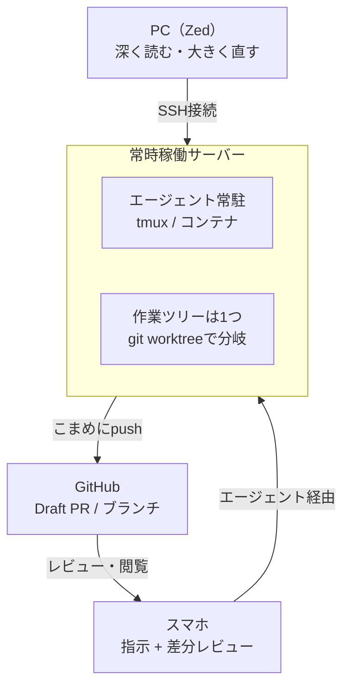
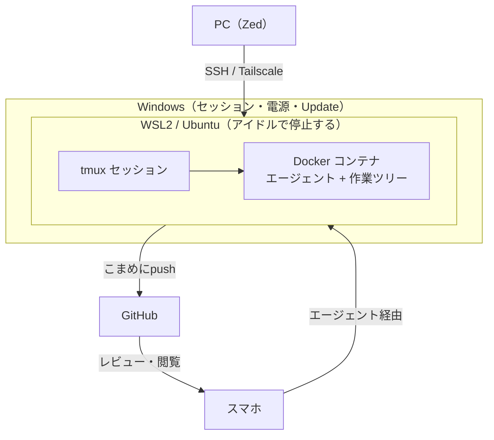

# 移動中も開発を継続するための構成

> 関連: [docker-isolation.md](docker-isolation.md) — Dockerによる隔離の仕組みと設定の詳細

## 目次

| セクション | 内容 |
| --- | --- |
| [目的](#目的) | 何を実現したいのか |
| [基本方針](#基本方針) | ワークスペースを1箇所に絞る／未コミットを放置しない |
| [構成図](#構成図) | 標準構成の全体像 |
| [各線の接続方式](#各線の接続方式) | 3本の線がそれぞれ何で繋がるか |
| [使用するサービス・ツール](#使用するサービスツール) | 各ツールが何のためのものか |
| [インストールするもの](#インストールするもの) | スマホ／サーバー／手元PCごとの導入物 |
| [tmux と Docker の関係](#tmux-と-docker-の関係) | 入れ子の順序とその理由 |
| [Dockerで何を隔離するか](#dockerで何を隔離するか) | 隔離する理由／守られるもの・守られないもの |
| [ビルド環境とOS](#ビルド環境とos) | OS依存はどこで発生するか |
| [運用ルール](#運用ルール) | 守るべき決めごと |
| [制約と落とし穴](#制約と落とし穴) | 仕組みで解けない部分 |
| [スマホから何がどこまで見えるか](#スマホから何がどこまで見えるか) | エージェントアプリの実体／経路ごとの可視範囲 |
| [認証まわり](#認証まわり) | サブスクでのログインと維持 |
| [セッションとトークン消費の考え方](#セッションとトークン消費の考え方) | 「ノートと作業員」の例え／消費のタイミング |
| [補足：WSL2で構成する場合](#補足wsl2自宅windowspcで構成する場合) | 別案の構成図と考慮事項 |
| [導入ステップ](#導入ステップ) | どの順で着手するか |
| [未決事項](#未決事項) | まだ決めていないこと |

---

## 目的

PCの前にいるときだけでなく、通勤などの移動中もAIエージェントによる設計・実装を進められるようにする。
スマホをエディタにするのではなく、**スマホを「操縦席」にして、実行は常時稼働のサーバーに任せる**。

---

## 基本方針

### ワークスペースは1箇所だけにする

ノートPCとサーバーの両方にクローンを置くと、「昨日電車で進めた分がPCに無い」「家で直した分がサーバーに無い」という同期問題が毎日発生する。
**リポジトリはサーバー上の1箇所だけ**に置き、ノートPCのZedはSSH経由でその同じディレクトリを開く。これで同期問題そのものが存在しなくなる。

トレードオフとして、ネットに繋がらない場所ではPCでも作業できなくなる。飛行機・地下などでの例外運用を許すかどうかは別途決める。

### 未コミットのまま放置しない

エージェントの成果物が「サーバー上の未コミット変更」のまま溜まると、スマホから見る手段がエージェントアプリだけになる。
**区切りごとにコミット & pushさせ、GitHubに押し出す**ことで、可視化の問題をGitHub側に丸投げできる。

---

## 構成図



### 図の読み方

1. **中央のサーバーが唯一の作業場所**。PCもスマホも、そこに繋ぎに行くだけの端末。
2. **左右で入口が違う**。ZedはSSHで直接。スマホはAnthropic / OpenAIのクラウドを経由するので、VPN設定は不要。
3. **右端の帰り道が核心**。pushしてGitHubに出しておけば、mobile GitHubがそのまま差分ビューアとファイルブラウザになる。この一周が閉じることが構成の成立条件。

---

## 各線の接続方式

図の線は、すべて同じ繋がり方をしているわけではない。

| 線 | 経路 | 追加設定 |
| --- | --- | --- |
| スマホ → サーバー（エージェント） | ベンダーのクラウドが中継 | 不要 |
| PC（Zed） → サーバー | SSHで直接 | Tailscale等が要る |
| SSHクライアント → tmux | SSHで直接 | Tailscale等が要る |

### スマホ → サーバーは直接繋がっていない

```
スマホ ──HTTPS──▶ Anthropic / OpenAI のサーバー ◀──HTTPS── 常時稼働サーバー
```

サーバー上のClaude Codeはアウトバウンド（外向き）のHTTPSリクエストのみを使い、インバウンドポートを一切開かない。
Remote Controlセッションを開始するとAnthropic APIに登録して定期的にポーリングし、別のデバイスから接続するとAnthropic API側がクライアントとローカルセッションの間をストリーミング接続で中継する。通信はTLSで暗号化され、認証には単一目的にスコープされた短命な認証情報が使われる。

**両側から外に向かって出ていき、真ん中で待ち合わせる**形。そのため、サーバーが自宅ルーターの内側にいてもポート開放は不要で、マシンが直接インターネットに晒されることもない。

Tailscaleが必要になるのは、SSHで直接繋ぐ下2本の線だけ。

---

## 使用するサービス・ツール

### 土台

| 名称 | 役割 |
| --- | --- |
| 常時稼働サーバー（自宅サーバー / VPS） | ソースコードとエージェントの唯一の置き場所。Macはスリープで止まるため、常時起動のマシンが必要。目安はRAM 16GB（Rust / Tauriを含むなら32GB）、ディスク512GB以上。推論はクラウド側なので、重いのはエージェントではなく言語サーバーとビルド |
| tmux | プロセスを生かしておく土台。SSHを切ってもエージェントが死なないようにする。**UIとしては期待しない**。**ホスト側にネイティブでインストールする**（後述） |
| Docker / devcontainer | エージェントの暴走を閉じ込める箱。壊れても作り直せばよい状態にする |
| Tailscale | 外から自宅サーバーへ、ポート開放なしで繋ぐための経路。**SSHで直接繋ぐ線でのみ必要**（Zed、SSHクライアント、code-server）。スマホのエージェント接続には不要 |

### コードとレビュー

| 名称 | 役割 |
| --- | --- |
| Git / GitHub | 成果物を「スマホから見える場所」に押し出す先。可視化を自作しないための逃がし先 |
| git worktree | 並列タスクを物理的に分離する。1つのworktreeで1つのブランチだけ担当させる |
| Draft PR | 作業中の変更をレビュー可能な形にしておく器。行コメントがそのままエージェントへの指示になる |
| AGENTS.md / CLAUDE.md | エージェントへの運用規約の置き場所。worktreeの扱い、禁止操作、push頻度などを明文化する |

### インターフェース

| 名称 | 役割 |
| --- | --- |
| Zed（Remote Development） | PCに座ったときの編集窓口。UIは手元、コード・言語サーバー・ターミナルはサーバー側で動く |
| Claude Code Remote Control / Codexモバイル | 移動中の指示出しと進捗確認の主戦場。差分・出力・承認待ちが整形されて届く |
| GitHubモバイルアプリ | 腰を据えたレビュー用。ブランチのファイルツリー閲覧、Markdownのレンダリング表示 |
| SSHクライアント（Termius等） | tmuxを直接覗くための非常口。スマホでは操作性が悪いので常用しない |
| code-server | 予備のフォールバック。散らかった未コミット状態を探索したいときだけ。常用前提にしない |

---

## インストールするもの

### スマホ

| アプリ | 用途 | 必須度 |
| --- | --- | --- |
| Claude（iOS / Android） | 「コード」タブから指示・進捗確認。プッシュ通知が受け取れる | 必須 |
| ChatGPT（iOS / Android） | Codexを使う場合の窓口 | 任意 |
| GitHub | PRレビュー、ブランチのファイル閲覧、Markdown表示 | ほぼ必須 |
| Termius など SSHクライアント | tmuxを直接覗く非常口 | 任意 |
| Tailscale | SSHクライアントで自宅サーバーに入る場合に必要 | 上記を使うなら必要 |

ブラウザで `claude.ai/code` を開いても同じ画面になるが、アプリのほうがプッシュ通知を受け取れる分だけ実用的。

### サーバー（WSL2のUbuntu / Linux）

| 名称 | 用途 |
| --- | --- |
| git | 言うまでもなく必須 |
| tmux | プロセスを生かしておく土台 |
| Docker Engine | エージェントを閉じ込める箱。Docker Desktopではなくこちら |
| Claude Code CLI | エージェント本体 |
| Codex CLI | エージェント本体（併用する場合） |
| GitHub CLI（`gh`） | Draft PRの作成をエージェントにやらせる場合 |
| openssh-server | ZedのRemote Developmentで接続するため |
| Tailscale | 外からSSHで入るための経路。**Windows側ではなくWSL内に入れる** |
| code-server | 任意。緊急時のフォールバック |

**Claude Code CLIはネイティブインストーラーが推奨で、Node.jsもnpmも不要**。npmパッケージも同じネイティブバイナリをインストールする仕組みで、インストールされた `claude` バイナリ自体はNodeを呼び出さない。

WSLでnpm経由を選ぶ場合の注意として、`which node` と `which npm` が `/mnt/c/` ではなく `/usr/` で始まるLinuxパスを指している必要がある。Windows側のNode.jsを拾っていると `exec: node: not found` になる。

### 手元PC（Mac）

| 名称 | 用途 |
| --- | --- |
| Zed | Remote Developmentでサーバーに接続する窓口 |
| Tailscale | サーバーへのSSH経路 |
| Claude Code CLI / Codex CLI | Phase 0の検証用。サーバー移行後は必須ではない |

---

## tmux と Docker の関係

守る対象が違うため、入れ子の順序は決まっている。

- **tmux**: プロセスを生かしておく。守る相手は「SSH接続が切れること」
- **Docker**: 環境を閉じ込める。守る相手は「エージェントが環境を壊すこと」

接続が切れても生き残ってほしいのはコンテナごとなので、**tmuxが外側**になる。

```
ホストOS
 └─ tmux セッション（接続が切れても生き続ける）
     └─ docker exec でコンテナに入る
         └─ エージェント（隔離された環境で動く）
```

したがって**tmuxはホスト側にネイティブでインストールする**。コンテナ内にtmuxを置くと、コンテナ再起動でセッションが消え、tmuxの存在意義が失われる。設定ファイルをホストに残せる点でも外側が自然。

並列タスクは、worktreeごとにtmuxのウィンドウを分けて扱う。worktreeの置き場所には制約があるため [worktree はリポジトリ配下に置く](docker-isolation.md#worktree-はリポジトリ配下に置く) を参照。

Dockerで具体的に何を隔離し、何が守られないかは [Dockerで何を隔離するか](#dockerで何を隔離するか) を参照。

---

## Dockerで何を隔離するか

ここでは構成上の判断だけを扱う。**bind mountの挙動、マウント先のパス、UIDの合わせ方、worktreeの置き場所、リポジトリ設定の届き方**といった実装レベルの詳細は [docker-isolation.md](docker-isolation.md) にまとめてある。

### なぜ隔離するのか

Dockerを入れる理由は「隔離それ自体」ではなく、**自動承認を許可するための前提条件**である。

この構成の目的は、見ていない時間にエージェントを進ませること。すると承認の扱いは2択になる。

| 選択 | 帰結 |
| --- | --- |
| 逐一承認する | スマホで許可プロンプトを一つずつ叩く。移動中の運用としては成立しにくい |
| 自動承認する | 見ていない相手に、そのユーザーの権限をそのまま渡すことになる |

Dockerが意味を持つのは後者を選んだときだけ。逆に言えば、**[未決事項](#未決事項)の「自動承認をどこまで許可するか」が決まらないとDockerの要否も決まらない**。判断の順序としては自動承認の方針が先にある。

閉じ込める対象はエージェントのプロセスだが、実質的には「エージェントが呼び出すもの全部」— `npm install`、ビルド、テスト、生成されたスクリプトの実行までを含む。むしろ後者のほうが危険度が高い。postinstallスクリプトのような自分で書いていないコードが、見ていない時間に走る。

### 何が守られ、何が守られないか

Dockerは**権限を制限する仕組みではなく、見える範囲を制限する仕組み**である。したがって守られる範囲は**マウントの有無だけ**で決まる。

| | 対象 | 理由 |
| --- | --- | --- |
| 守られる | WSL distro本体（apt / グローバルパッケージ） | マウントしていない |
| 守られる | `/mnt/c` のWindows側ファイル | マウントしていない |
| 守られる | 他のリポジトリ | マウントしていない |
| 守られる | SSH鍵（`~/.ssh`） | マウントしていない |
| **守られない** | マウントした作業ツリーの中身 | マウントしている。ただしgitで復元できる |
| **守られない** | GitHubへのpush権限 | 資格情報がコンテナ内にある以上、force pushは中からできる |
| **守られない** | ネットワーク到達範囲 | Dockerは通信を塞がない。外向き通信もLAN・tailnetへの到達も生きたまま |

隔離できるのは**環境**であって**資産**ではない。push権限はDockerでは解けないため、リポジトリ限定のfine-grained PATに絞る、あるいはコンテナからはpushさせない、という別の手当てが要る（[運用ルール](#運用ルール)参照）。

なお、ファイルシステムは分離されるが**カーネルとホストへのネットワーク経路は共有される**。想定する脅威が操作ミス・暴走ならDockerで足りるが、悪意あるコードまで広げるなら資格情報を持たせない方向で対処する。→ [コンテナから何が見えるか](docker-isolation.md#コンテナから何が見えるか)

### マウントするもの

渡すのは**リポジトリ全体**と**認証情報**の2つだけ。`~/.ssh` も `$HOME` 全体も渡さない。

リポジトリはホストと**同一のパス**にマウントする（別パスにすると git worktree の絶対パス解決が壊れる）。worktree はリポジトリ配下の `.worktrees/` に置き、マウント範囲を1リポジトリに留める。

→ 詳細は [マウント方針](docker-isolation.md#マウント方針)

### リポジトリはコンテナ内にクローンしない

作業ツリーはホスト側に置き、bind mountで渡す。コンテナ内にcloneはしない。

守る価値の順位が理由になる。

1. 認証情報（GitHub / SSH鍵 / エージェントのトークン）
2. `/mnt/c` のWindows側
3. distroのシステム環境・他プロジェクト
4. 作業中のリポジトリ ← **最も低い**

4が最も低いのは、gitに入っており「[未コミットのまま放置しない](#基本方針)」という運用ルールがあるため。壊れても取り戻せる唯一の資産が4であり、1〜3は壊れたら手作業で復旧するしかない。そして1〜3は**マウントしないだけ**で守れる。

コンテナ内cloneで追加的に守れるのは4だけで、その対価としてZedからの編集経路を失う。割に合わない。

### 導入の時期

**[Phase 2](#phase-2サーバーを立てるwsl2の場合)の時点では入れない。** 素のWSL上で承認プロンプトありで動かし、移動中の運用がそれで成立するかを先に測る。承認の煩わしさで詰まった時点が、コンテナを入れる正しいタイミングであり、その頃には何をコンテナに入れるべきかも具体的に分かっている。

層が増えることの代償もある。復帰経路が systemd → docker start → tmux → docker exec と伸びるぶん、自動復帰の確実性は下がる。**「落ちない」より「戻る」**という方針とはトレードオフの関係にあり、この点でも「必要になってから入れる」が妥当。

コンテナの手前に、費用対効果の高い選択肢がある。

| 手段 | 効果 |
| --- | --- |
| エージェント専用のUnixユーザーを作る | ファイル権限で分離できる。ほぼコストゼロ |
| `wsl.conf` で `/mnt/c` の自動マウントを切る | Windows側への波及を遮断 |
| エージェントのpermissionルールでallow / denyを宣言 | 「読み取りと安全なコマンドは自動、破壊的操作は拒否」を、層を増やさずに実現 |
| push用の資格情報をエージェントから分離 | Dockerでは守れない部分をここで守る |

最後の1つは、Dockerを入れるかどうかと無関係に実施する価値がある。

---

## ビルド環境とOS

手元PCとサーバーのOSは**一致していなくてよい**（手元macOS / サーバーLinuxが標準的）。Zedは手元でUIを動かし、サーバー側にはヘッドレスサーバーが入るだけなので、SSHで繋がれば成立する。むしろ開発環境がLinuxに揃うぶん、本番との差異が減る。

ただし成果物の種類によってOS依存の度合いが違う。

| 成果物 | 実行される場所 | OS依存 |
| --- | --- | --- |
| HTML / CSS / JS | ブラウザ | なし |
| Node / Python のコード | 各OSのランタイム | ほぼなし |
| ネイティブバイナリ（Rust / Go / C++） | OSカーネル上で直接 | あり |
| コンテナイメージ | Linuxカーネル | Linux前提 |

判断基準は「ホストのOS」ではなく「成果物が最終的にどこで動くか」。

### 注意が必要なケース

- **ネイティブ拡張を含むパッケージ**（`sharp`、`better-sqlite3`、`node-gyp`が走るもの、NumPy系など）は、OSとCPUアーキテクチャごとにバイナリが異なる。
  → `node_modules` や仮想環境を**マシン間でコピーしない**。ロックファイルは共有し、インストール結果は共有しない。コンテナ内で開発すれば構造的に起きなくなる。
- **デスクトップアプリのビルドはOSを跨げない**。macOS向けTauriバイナリはLinuxサーバー上で作れない（Apple SDKと署名が必要）。
  → ビルドはGitHub ActionsのmacOS / Windowsランナーに任せれば、サーバー構成の外に追い出せる。ただし**実機での動作確認だけはPCの前に戻る必要がある**。
- Goは `GOOS` / `GOARCH` を変えるだけでクロスコンパイルできるため、CLIツールではこの制約をほぼ気にしなくてよい。

この構成では開発も実行もサーバー上のコンテナで完結するため、問題が顔を出すのは**配布の段階だけ**。

---

## 運用ルール

- **長時間タスクはZedのエージェントパネルではなくtmux内のCLIで起動する**
  ZedはSSH接続時にクライアントを閉じるとエージェントスレッドが中断される。ノートPCを閉じた瞬間に作業が止まると、常時稼働にした意味が無くなる。
- **エージェントは必ずtmuxの中で起動する**
  tmuxの外で起動すると、SSH切断時にプロセスごと消え、スマホから繋ぐ先が無くなる。
- **mainは保護し、エージェントはfeature系ブランチのみ触れるようにする**
- **サーバー用の認証情報は専用のデプロイキー / fine-grained PATを使う**
  Macの個人鍵はコピーしない。鍵の権限範囲が最後の安全弁になる。
- **`.env` などのシークレットはリポジトリに入れず、サーバー側に置く**
  スマホ画面にターミナル出力が流れる以上、機密が表示され得る前提で運用する。

---

## 制約と落とし穴

- **GUIアプリの動作確認は移動中にできない**
  Tauriデスクトップアプリなどは、電車内でできるのは設計・ロジック・テストの検討まで。実機確認はPCに戻ってから。
- **移動中に回すタスクは種類を選ぶ**
  ロジック実装、テスト追加、リファクタ、設計ドキュメント執筆、依存更新などが向く。
- **worktreeを分けてもコンフリクトは起きる**
  同じファイルを別worktreeで編集すれば統合時に衝突する。どのブランチでどのファイル範囲を触るかを先に決める。
- **サーバーが落ちると何もできなくなる**
  こまめなコミット & pushが、そのままバックアップを兼ねる。

### セッションの生存条件

- **ターミナルを閉じるとセッションが終わる**
  Remote Controlはローカルプロセスとして動くため、ターミナルを閉じるかプロセスを止めるとセッションが終了する。これがtmuxの中で起動する必要がある直接的な理由。
- **ネットワーク断が約10分続くとタイムアウトする**
  マシンが起きていてもネットワークに到達できない状態が約10分以上続くとセッションが終了し、コマンドを実行して新しいセッションを立て直す必要がある。自宅サーバー運用なら、回線復旧時に自動で再起動する仕組みを検討しておく。
- 一方で、短時間の切断やスリープからは自動的に再接続される。

---

## スマホから何がどこまで見えるか

### 「エージェントアプリ」とは具体的に何か

構成図で「エージェント経由」と書いている経路の実体は、以下のいずれか。

| 呼び方 | 実体 | 備考 |
| --- | --- | --- |
| Claudeアプリの「コード」タブ | iOS / Android の Claude アプリ | アプリを入れていなくてもブラウザで `claude.ai/code` を開けば同じ画面。アプリの利点はプッシュ通知 |
| Codexモバイル | ChatGPTアプリ内のCodex | ホストマシンで動くCodexを遠隔で監督・承認できる |

Claudeアプリ側は、入力欄の上の環境切り替えから「リモートコントロール」を選ぶと、動作中のマシンが一覧に出る。オンラインのセッションにはPCのアイコンと緑の点が付く。同時に動かせるセッション数には上限がある（32）。

### 経路ごとに見えるもの

**スマホから見られない情報はほぼない**。制約があるのは「探索のしやすさ」と「自分の手で書くこと」。

| 見たいもの | エージェントアプリ | GitHubモバイル | SSH（Termius） |
| --- | --- | --- | --- |
| **未pushのローカル差分** | ○ 聞けば出る | ✕ 見えない | ○ |
| ブランチのファイルツリー閲覧 | △ 聞けば出る | ○ 得意 | △ |
| 任意のファイルの中身 | ○ 聞けば出る | ○ | ○ |
| PRの差分・行コメント | ✕ | ○ 得意 | ✕ |
| Markdownのレンダリング表示 | ○ | ○ | ✕ |
| ターミナル出力・テスト結果 | ○ | ✕ | ○ |
| 自分の手で大きく書き換える | ✕ | ✕ | △ 現実的でない |

未pushのローカル差分も見える。エージェントはサーバー上で動いているため、`git diff` を実行させれば出力が返ってくる。

ただし性質が違い、これは**プル型**（自分から要求して初めて出る）。一覧を眺めていて変更に気づく、という使い方には向かない。pushしておけばGitHub側が**プッシュ型**（並んでいるものを眺める）になり、両者が補完し合う。

### 「深く読む」「大きく直す」の正確な線引き

構成図のラベルは「深く読む・大きく直す」としているが、正確には「**自分の手で書く**」がPC側の役割。

- **深く読む** → 目的が定まった読み（呼び出し元の調査、設計の問題点指摘）はスマホでも可能。むしろ速いこともある。苦手なのは目的が曖昧なままの**探索的な読み**
- **大きく直す** → エージェントに指示して大規模な変更をさせることは移動中でも可能。変更の規模は制限されない。違うのは**自分が書くのか、指示するのか**

### 実際の使い方としての位置づけ

スマホで詳細なレビューをするのは難しいが、**エージェントを止めないこと自体に価値がある**。承認待ちで数時間放置されるのと、すぐ返せるのとでは、トータルの進みがまるで違う。

移動中のスマホは**レビューの場ではなく、詰まりを解消する場**と捉えるのが実態に近い。

### 安定性についての注意

環境によっては接続が安定せず、PCがスリープから復帰した後にセッションが再同期できなくなったり、セッション一覧から消えたりする報告がある。公式ドキュメントにもresearch previewの記載がある。

→ **Phase 0で自分の環境での安定性を確かめる意味は大きい**。

---

## 認証まわり

CodexとClaudeはいずれもサブスクプランで利用する。**tmuxと認証は無関係**で、認証はCLI自身が行い、結果をサーバー上のディスクに保存する。tmuxセッションを閉じても認証は消えない。

- **初回ログイン**：サーバーにブラウザが無いため、`c` を押してログインURLをコピーし手元のブラウザで認証、表示されたコードをターミナルに貼り戻す。WSL2・SSHセッション・コンテナで一般的な手順として公式に用意されている。WSL2ならWindows側のブラウザを直接開けるためさらに容易
- **ログインの継続**：認証情報はディスクに保存され、トークンは自動更新される。再起動を挟んでも維持される。`claude auth status` で状態確認できるので、自動起動スクリプトにチェックを挟むとよい
- **環境変数 `ANTHROPIC_API_KEY` が残っていると、そちらが優先される**。サブスクで使うつもりがAPI課金になる事故が起きやすい。サーバー構築時に空であることを確認する
- **長期OAuthトークンではRemote Controlを使えない**（推論のみにスコープされている）。サーバー上で通常のログイン状態を維持する必要がある

---

## セッションとトークン消費の考え方

### 「セッション」は2つの意味で使われる

混同しやすいので、例え話で分けておく。エージェントは**ノートを持った作業員**だと考える。

- **ノート** = これまでの会話がすべて書かれた紙。サーバーのディスクに保存される
- **作業員** = 実際に手を動かしている人。メモリの中にいるプロセス

```
サーバーのディスク          サーバーのメモリ
┌──────────────┐      ┌──────────────┐
│  会話の記録    │ ←読む │  claude       │
│  （ノート）    │ 書く→ │  （作業員）    │
└──────────────┘      └──────────────┘
     残る                    消える
```

**作業員は使い捨てで、ノートが本体**。セッションが終了して消えるのは作業員だけで、ノートは残る。

### タイムアウトで起きること

セッションがタイムアウトしても、実害は限定的。

| 失われるもの | 残るもの |
| --- | --- |
| 走行中だったタスク | サーバー上のファイル変更 |
| スマホからの接続先（一覧から消える） | 認証情報（再ログイン不要） |
| 自動で再開してくれる性質 | 会話の記録（`claude --resume` で再開可能） |

復旧は `claude remote-control` を実行し直すだけ。**手動で呼び直す一手間が増えるだけ**で、ゼロからやり直しにはならない。

困るのは移動中に気づけないケースなので、対処は既存の運用ルールと同じ（こまめなpush、自動再起動の仕組み）。

### 再開のコストと限界

- **ノートを読み直す分のトークンを消費する**。長く続いた会話ほど再開が重くなるため、タスクの区切りで新しいセッションに切り替えるとよい
- **暗黙の把握までは引き継がれない**。「このファイルは確認済み」といった作業員の頭の中にあった判断は残らないため、再開後に同じ調査を繰り返すことがある

### トークンが消費されるタイミング

tmuxでプロセスが起動しているだけ、タスクを実行していない待機状態では**消費されない**。消費するのは指示であって稼働時間ではない。実際に発生するのは以下。

- プロンプトを送ったとき
- エージェントがツールを実行し、結果を読んで次の判断をするとき（1タスク内で何往復も発生）
- スマホから会話を開き、過去のやり取りが再送されるとき

なお、Remote Controlの接続維持のためのポーリングは推論リクエストではないため、利用上限とは無関係。

### 帰結：会話に頼らず、リポジトリに書き出す

作業員は入れ替わる前提なので、**決まったことは会話履歴ではなくリポジトリ側に残す**。

- 設計判断や方針 → ドキュメントとしてコミット
- 作業の区切り → コミットメッセージ
- 進行中のタスク → Draft PRの説明欄

これらは新しい作業員が「プロジェクトの一部」として読めるため、セッションが切れても影響が小さくなる。ドキュメントを書き出す運用は、AIと組む場合は手間ではなく**保険**として機能する。

---

## 補足：WSL2（自宅WindowsPC）で構成する場合

専用のLinuxマシンを用意せず、手持ちのWindows PCをサーバーにする案。**追加投資ゼロで始められる**のが利点。中身はgit / Docker / tmuxなので、後から専用機に移す際もリポジトリをclone し直すだけで済み、後戻りコストは低い。

### 構成図



標準構成に対して、**生存条件が2段増える**（Windowsのセッションと、WSL2のVM）。

### 考慮すべきこと

| 項目 | 内容 | 対処 |
| --- | --- | --- |
| WSLのアイドル停止 | すべてのコンソールを閉じて一定時間経つとVMが自動停止する。systemdでデーモンを動かしていてもアイドル判定されることがある | タスクスケジューラで `wsl.exe` のプロセスを常時1つ掴んでおく（`sleep infinity` 等を非表示で実行） |
| ログイン依存 | WSL自体はWindowsにログインしないと起動しない | タスクスケジューラで起動時に自動起動。引数の `-u root` が重要（ユーザーセッションが無いと起動に失敗することがある）。WSL側で `loginctl enable-linger` も有効化 |
| Windows Update | **設定では潰しきれない**。延期はできてもいずれ必ず再起動される | 「起きない」ではなく「起きても壊れない」設計にする（下記） |
| 電源設定 | スリープ・休止状態・高速スタートアップが有効だと止まる | すべて無効化 |
| ファイルシステム | `/mnt/c/` 配下にリポジトリを置くとファイルアクセスが桁違いに遅く、`npm install` やgit操作が実用に耐えない | **必ずLinux側（`/home/...`）に置く**。例外なし |
| Docker | Docker DesktopはWindowsのGUIセッションに依存し、常時稼働と相性が悪い | WSL内にDocker Engineを直接インストール（systemd有効化が前提） |
| メモリ配分 | 既定ではホストRAMの大部分を取りに行く | `.wslconfig` で上限を明示 |
| Tailscale | Windows側に入れてもWSLまで届かない | **WSLの中にインストールする**。WSL自身がtailnet上の1ホストになる |
| スマホからの経路 | 影響を受けない。アウトバウンドHTTPSなのでWSLのIPは無関係 | 対処不要。面倒なのはSSH系の線だけ |

### 設計方針：「落ちない」より「戻る」

家庭環境で24時間の連続稼働を保証するのは無理がある（Windows Update、停電など）。**復帰の自動化を設計に含める**ほうが確実。

- 再起動後に、WSL起動 → tmuxセッション → エージェント起動まで自動で立ち上がる状態にしておく
- エージェントにこまめにコミット & pushさせる。pushされていれば再起動を挟んでも作業内容は残る

---

## 導入ステップ

順序には理由がある。**先に運用ルールを固めてからサーバーを作る**。逆にすると、環境構築で消耗したあとに「そもそもこの働き方が合わなかった」と判明する可能性がある。

### Phase 0：この働き方が自分に合うか確かめる（投資ゼロ）

いま手元にあるMacだけで完結する。ここで合わないと分かれば、以降は不要。

- [ ] Claude Code を Remote Control で起動し、スマホの Claude アプリから接続してみる
- [ ] Codex モバイル（ChatGPTアプリ）からも同様に繋いでみる
- [ ] 通勤の往復で実際に指示を出し、スマホでレビューしてみる
- [ ] 通知設定を有効にする（入力待ちに気づけないと成立しない）

**判断ポイント**：スマホでの指示・レビューが苦にならないか。音声入力で足りるか。

### Phase 1：運用ルールを固める（サーバー不要）

Phase 0 で手応えがあったら、1リポジトリだけで運用の型を作る。GUIを持たないリポジトリのほうが検証しやすい。

- [ ] `AGENTS.md` / `CLAUDE.md` に規約を書く（Draft PRを開く、区切りごとにpush、worktreeの扱い、禁止操作）
- [ ] worktreeは `.worktrees/` 配下に作る運用にし、`.gitignore` に追加する
- [ ] エージェントにDraft PRを開かせ、こまめにpushさせる流れを一周試す
- [ ] GitHubモバイルアプリを入れ、PRに行コメントを付けてエージェントに反映させてみる
- [ ] mainを保護し、feature系ブランチにしか触れないようにする

**判断ポイント**：スマホ側で「見たいものが見える」状態になっているか。

### Phase 2：サーバーを立てる（WSL2の場合）

ここから環境構築。Windows本体の設定を先に済ませる。

- [ ] スリープ・休止状態・高速スタートアップを無効化、Windows Updateのアクティブ時間を設定
- [ ] WSL2 + Ubuntu を導入し、`wsl.conf` で `systemd=true` を有効化
- [ ] `.wslconfig` でメモリ上限を明示
- [ ] リポジトリを **`/home/...` 配下**にclone（`/mnt/c/` は不可）
- [ ] （自動承認に踏み切る段階で）WSL内に Docker Engine を直接インストール（Docker Desktopは使わない）→ [Dockerで何を隔離するか](#dockerで何を隔離するか)
- [ ] コンテナを使う場合、リポジトリは**ホストと同一パス**にマウントし、コンテナ内のUIDをホストに合わせる → [docker-isolation.md](docker-isolation.md#マウント方針)
- [ ] WSL内に tmux をインストール（※WSL構成では「ホスト側」＝WSLのUbuntu内を指す。コンテナ内ではない）
- [ ] Claude Code / Codex CLI をインストールしてログイン（`c` でURLをコピーし手元のブラウザで認証）
- [ ] `echo $ANTHROPIC_API_KEY` が空であることを確認
- [ ] tmux 内でエージェントを起動し（コンテナを入れた場合は tmux → `docker exec` → エージェント の順）、スマホから接続できることを確認

**判断ポイント**：スマホから、サーバー上のエージェントに指示が通るか。

### Phase 3：PCからの窓口とネットワークを繋ぐ

- [ ] WSL内に Tailscale をインストール（Windows側ではない）
- [ ] WSL内に sshd を立て、Tailscale経由でSSH接続できることを確認
- [ ] ZedのRemote Projectsからサーバー上のディレクトリを開く
- [ ] 長時間タスクはZedのエージェントパネルではなくtmux内で起動する習慣にする

**判断ポイント**：PCとスマホが同じ作業ツリーを見ている状態になっているか。

### Phase 4：復帰を自動化する

ここまでで動くが、放置すると必ず止まる。**「落ちない」より「戻る」**を作り込む。

- [ ] タスクスケジューラでWindows起動時にWSLを自動起動（引数の `-u root` を忘れない）
- [ ] `wsl.exe` のプロセスを1つ掴み続ける仕組みを入れる（アイドル停止の回避）
- [ ] WSL側で `loginctl enable-linger` を有効化
- [ ] systemd で tmuxセッションとエージェントの自動起動を設定
- [ ] 起動スクリプトに `claude auth status` のチェックを挟む
- [ ] **意図的にWindowsを再起動し、放置して復帰するか実地で確認する**

最後の1項目が肝心。仕込んだつもりで動いていない、が一番起きやすい。

---

## 未決事項

- 常時稼働サーバーを自宅サーバーにするか、VPSにするか、手持ちのWindows PC（WSL2）にするか
- オフライン時（飛行機・地下など）にローカルクローンを許すかどうか
- エージェントの自動承認をどこまで許可するか（移動中に承認待ちで止まらせないための設計）。この判断が [Dockerで何を隔離するか](#dockerで何を隔離するか) の要否を先に決める
