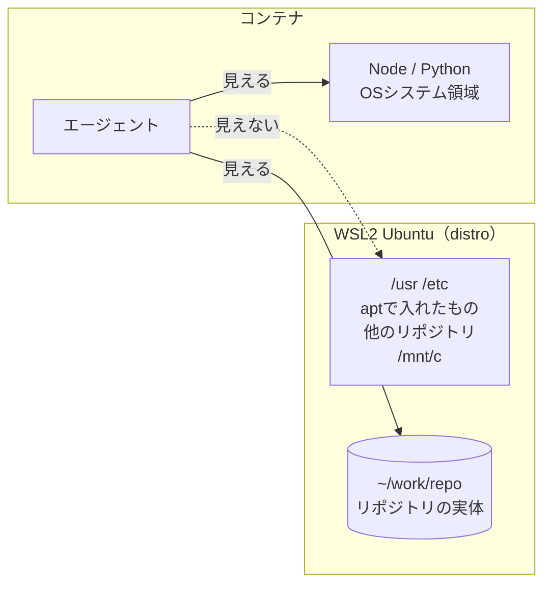

# エージェントをDockerに隔離する — 仕組みと設定

## この文書について

「なぜ隔離するのか」「いつ導入するのか」といった構成上の判断は [architecture.md](architecture.md) にある。
こちらは、実際に構築するときに必要な**Dockerの挙動と設定の詳細**を扱う。

| セクション | 内容 |
| --- | --- |
| [大前提](#大前提dockerは権限ではなく見える範囲を制限する) | 全体を貫く1行 |
| [コンテナから何が見えるか](#コンテナから何が見えるか) | 分離される層・されない層 |
| [bind mount の仕組み](#bind-mount-の仕組み) | コピーではない／同期は起きない |
| [マウント方針](#マウント方針) | 何をどこに渡すか |
| [リポジトリ単位のエージェント設定](#リポジトリ単位のエージェント設定) | `.claude/` は届くのか |
| [手元PCからの編集](#手元pcからの編集) | コンテナに入る必要はあるか |
| [隔離を無効化してしまう操作](#隔離を無効化してしまう操作) | やってはいけないこと |
| [検討中に出た疑問](#検討中に出た疑問) | Q&A |
| [誤解していた点の整理](#誤解していた点の整理) | 引っかかった箇所の一覧 |

---

## 大前提：Dockerは「権限」ではなく「見える範囲」を制限する

この1行を取り違えると、以降の理解が全部ずれる。

- ❌ 「エージェントに強い権限を渡さないから安全」
- ⭕️ 「エージェントから**見えない**から触れない」

そもそもエージェントは、ホスト上でも root 権限を持っていない（`sudo` しなければ）。権限で守っているのではない。

むしろ逆で、**コンテナの中ではエージェントに root を持たせてよい**。被害が箱の中で閉じるからで、これにより `sudo apt install` で承認待ちにならずに済む。「守りの仕組み」に見えて、実際には**自走させ続けるための仕組み**でもある。

---

## コンテナから何が見えるか



### 見えないもの

| 対象 | 理由 |
| --- | --- |
| distro の `/usr` `/etc` `/home` | コンテナに見えるのはイメージの中身。distroのファイルは mount namespace に**存在しない** |
| distro に apt で入れたパッケージ | 同上。コンテナ内の `apt list` は別世界 |
| ホスト側のプロセス | PID namespace が分離されている（`--pid=host` を付けない限り） |
| `/mnt/c`（Windows側） | WSL distro 側のマウントであり、コンテナには引き継がれない |
| 他のリポジトリ | マウントしていない |

### 分離されていないもの

| 対象 | 実際どうなるか |
| --- | --- |
| **カーネル** | WSL2のカーネルをそのまま共有する。`uname -a` はホストのカーネルを返し、`/proc/cpuinfo` `/proc/meminfo` もホストの値が見える |
| **ホストへのネットワーク到達** | デフォルトのbridgeではgateway（通常 `172.17.0.1`）がホスト自身。コンテナからホストの待ち受けポートにTCP接続できる |
| bind mount したパス | 渡した範囲はそのまま読み書きできる |

2行目はこの構成で具体的な意味を持つ。Phase 3 で WSL 上に sshd を立てるため、**コンテナからその sshd に到達できる**。鍵を渡していないので入れないが、経路が無いわけではない。

> **まとめ：ファイルシステムとしては見えない。しかし distro は「隣にいる」。**

### 脅威の想定によって対処場所が変わる

| 想定する脅威 | 対処 |
| --- | --- |
| エージェントの**操作ミス・暴走** | 見えない＝壊せない、で足りる。Dockerで完結する |
| **悪意あるコード**（依存パッケージ、プロンプトインジェクション） | 共有カーネルとネットワーク経路が残る。箱を厚くするのではなく、**資格情報を持たせない**（`~/.ssh` を渡さない、push権限を分離する）で対処する |

---

## bind mount の仕組み

### コピーではない

ディスク上の実体は1つで、そこに届く**経路が2本**ある、という状態になる。

```
        ディスク上の実体は1つ
                 │
    ┌────────────┴────────────┐
    │                         │
ホスト側から見た姿          コンテナ側から見た姿
/home/user/work/repo      /home/user/work/repo
    │                         │
  Zed が編集              エージェントが編集
```

- コンテナ内での編集は、**そのままホスト（distro）側のファイルの変更**になる
- 逆にホスト側で編集すれば、コンテナ内のエージェントにも即座に見える
- `.git` もマウント範囲内なので、コンテナ内での `git commit` はホスト側のリポジトリに履歴を残す

これは [基本方針](architecture.md#基本方針) の「ワークスペースを1箇所に絞る」をそのまま実装したもの。コンテナ内に別途 clone する方式だと作業ツリーが2つになり、避けたかった同期問題が戻ってくる。

### 同期は起きない（どちらの方向にも）

「停止中にホスト側を変更したら、再起動時に同期されるのか」という疑問が出るが、**同期という工程は存在しない**。コンテナ側はコピーを持っていないので、古くなりようがない。

家に例えると、**ドアが2つある1軒の家**になる。

| 状態 | 何が起きるか |
| --- | --- |
| コンテナ稼働中 | ドアが2つとも開いている。どちらから入っても同じ部屋 |
| **コンテナ停止中** | コンテナ側のドアが消える。**家の中身は無関係に存在し続ける** |
| 再起動 | ドアが付け直される。開ければ「今の」中身が見える |

したがって、

- 停止中にホスト側を変更しても、**書き換えるべきコンテナ側のファイルが存在しない**
- 再起動時に見えるのは、その瞬間のホストの中身。同期の成果ではなく、最初から1つしか無いだけ
- **コンテナ停止時に何かを書き戻す動作は無い**。コンテナ側の状態がホストを上書きすることはない
- ただし**稼働中は逆方向も筒抜け**。コンテナ内で書けばホスト側が変わる（これは意図した挙動）

### 名前付き volume は挙動が違う

`~/.claude` を名前付き volume にする場合、bind mount とは初期化の挙動が異なる。ここは区別が必要。

| | bind mount（リポジトリ） | 名前付き volume（`~/.claude`） |
| --- | --- | --- |
| 実体の場所 | ホスト側にある1つのファイル | Dockerが管理する領域 |
| 初回起動時 | 何もしない。ホストの中身がそのまま見える | **volume が空なら、イメージ内の該当パスの中身がコピーされる** |
| ホストから直接見えるか | 見える（普通のパス） | 直接は見えない |

volume のほうは初回に限り「コンテナ側の内容が外に出る」に近い動きをする。リポジトリでは起きないが、`~/.claude` では起きる。

### マウント先の既存ファイルは覆い隠される

bind mount 先のパスにイメージ側が中身を持っていた場合、それは**消えるのではなく見えなくなる**。マウントを外せばまた現れる。

### 注意すべきなのは停止中ではなく稼働中

同期の心配は不要だが、代わりに**同時編集の競合**が起こり得る。

- エージェントがコンテナ内で編集中のファイルを、同じタイミングで Zed から編集すると、**後に書いたほうが勝つ**
- これは2つのエディタで同じファイルを開いているのと同じ状況で、Docker特有の問題ではない
- 対策も同じ。エージェントに触らせる範囲と自分が触る範囲を分ける

---

## マウント方針

### 渡すもの

```
WSL (Ubuntu)
├─ /home/<user>/work/<repo>   ← リポジトリの実体。Zedはここを直接見る
├─ ~/.claude                  ← 認証情報
└─ tmux
    └─ docker exec
        └─ コンテナ
            /home/<user>/work/<repo>   ← ホストと同一パスに bind mount
```

- 渡すのは**この2つだけ**。`~/.ssh` も `$HOME` 全体も渡さない
- マウントするのは**リポジトリ全体**であって、エージェントの設定ファイルだけではない
  - エージェントが編集する対象がソースコードそのものである以上、必要な最小単位は「作業ツリー1つ ＋ 認証情報」になる
- `~/.claude` には認証情報のほかにユーザーレベルの `settings.json` や plugins も含まれる
  - リポジトリ単位で設定を管理する方針なら、丸ごと渡すとその方針と食い違う
  - コンテナ内の `~/.claude` は名前付き volume でコンテナ自身のものとし、**認証情報だけを注入する**のが素直

### マウント先はホストと同じパスにする

`/workspace` のような別パスに置いてはいけない。理由は git worktree にある。

```
~/work/repo/.worktrees/feat-x/.git   ← ファイル。中身は絶対パス
   └─ gitdir: /home/user/work/repo/.git/worktrees/feat-x

~/work/repo/.git/worktrees/feat-x/gitdir   ← こちらも絶対パスで戻りを指す
   └─ /home/user/work/repo/.worktrees/feat-x/.git
```

**双方向が絶対パスで結ばれている**ため、コンテナ内でパスが変わると解決できず git が壊れる。

```bash
docker run \
  -v /home/user/work/repo:/home/user/work/repo \
  -w /home/user/work/repo \
  ...
```

副次的な利点として、エージェントが出力するパスがホストと一致するため、Zedで開き直すときの齟齬も消える。

### worktree はリポジトリ配下に置く

兄弟ディレクトリに作ると、親ディレクトリごとマウントする必要が生じ、**他のリポジトリまでコンテナから見えてしまう**。

| 置き場所 | 必要なマウント | 他のリポジトリ |
| --- | --- | --- |
| `../repo-feat-x`（兄弟） | `~/work` 全体 | **見えてしまう** |
| `repo/.worktrees/feat-x`（配下） | `~/work/repo` のみ | 見えない |

```bash
git worktree add .worktrees/feat-x
```

`.worktrees/` は `.gitignore` に入れる。

### コンテナ内のUIDをホストに合わせる

コンテナ内で root として動くと、作られたファイルは**ホスト側でも root 所有**になる。WSL2 + Docker Engine では、その後 Zed で編集しようとして書き込めない、という事態になる。

| 方法 | 内容 | トレードオフ |
| --- | --- | --- |
| `--user $(id -u):$(id -g)` を付ける | ホストの自分のUIDで動かす | コンテナ内でrootを失い、`apt install` が通らなくなる |
| **イメージ内にホストと同じUID/GIDのユーザーを作り、パスワード無しsudoを与える** | 普段は一般ユーザー、必要時のみsudo | イメージ作成時にUIDを合わせる手間 |

「コンテナ内では root を持たせてよい」という利点を残すなら後者。devcontainer で一般的なやり方でもある。

---

## リポジトリ単位のエージェント設定

### 設定は届く

`.claude/` `.agents/` などのリポジトリ固有の設定（カスタムエージェント、Skills、hook、permissionルール）は、**リポジトリの中にあるため、リポジトリをマウントした時点で一緒にコンテナへ入る**。

- エージェントは cwd から上に向かってプロジェクト設定を探すので、マウント先で起動すれば通常どおり効く
- gitignore されている `settings.local.json` のようなファイルも、マウントは git と無関係なのでそのまま見える

むしろ**設定をリポジトリ単位で置く運用のほうが、コンテナとは相性が良い**。ユーザ領域に置いているとコンテナ内のユーザ領域には存在しないという問題が起きるが、リポジトリに置いていればマウントに付いてくる。

### 環境は届かない

届くのは**設定ファイルだけ**であり、設定が前提とする環境は届かない。

- hook が `rg` `gh` `jq` を呼ぶなら、それらはイメージの中に無いと動かない
- Skills がスクリプトを実行するなら、そのランタイムがイメージに必要
- リポジトリごとにエージェントの種類（Claude Code / Codex）を変えるなら、どちらが要るかもリポジトリ次第になる

つまり「リポジトリ側の都合で決まる設定」と「イメージ側の都合で決まる環境」がズレる。

### だからコンテナ定義もリポジトリに置く

設定をリポジトリ単位にしているなら、**それが前提とする環境の定義も同じリポジトリに置く**のが一貫する。

```
repo/
├── .claude/           # エージェントの設定
├── .devcontainer/     # または docker/ — その設定が前提とする環境
└── src/
```

これで「このリポジトリではこのエージェントとこのツールチェーン」が一箇所で決まる。共通イメージを1つ作って全リポジトリで使い回す方向もあるが、リポジトリごとに構成を変えたいという前提とは逆行する。

---

## 手元PCからの編集

### コンテナに入る必要は無い

マウントした範囲はホスト側の実体そのものなので、**Zedで通常どおり開けばよい**。「エージェントはコンテナ内のファイル、自分はdistroのファイル」という二重構造にはならない。

| | 実体の場所 | 誰が触るか | ホストから見えるか |
| --- | --- | --- | --- |
| リポジトリ（コード、`.claude/`、`.git`） | **ホスト側** | 自分・エージェント両方 | **見える**。Zedで直接編集 |
| Node / Python などのツールチェーン | コンテナ内 | エージェントのみ | 見えない |
| OSのシステム領域（`/usr` `/etc`） | コンテナ内 | エージェントのみ | 見えない |

見えないのは「触る必要が無いもの」だけ。むしろリポジトリがホスト側にあるおかげで、`git diff` も Zed も GitHub も普段どおり効く。

### ただしツールチェーンが無いとLSPが動かない

ファイルは見えるが、**ホスト側にはツールチェーンが無い**。

Zed の Remote Development は SSH 先（＝ WSL の distro）で言語サーバーを動かすため、Node や Python がコンテナ内にしか無いと、distro 側で言語サーバーが起動できず**補完も型チェックも効かない**。ファイルは見えているのに、ただのテキストエディタになる。

| 方法 | 内容 | 評価 |
| --- | --- | --- |
| **Zedをコンテナに直接繋ぐ** | コンテナ内にsshdを立て、Zedの接続先をホストではなくコンテナにする | ファイルはホスト側の実体のまま、LSPはコンテナ内で動く。両立する |
| ホストにもツールチェーンを入れる | distroにもNode / Pythonを入れる | 単純だが二重管理。miseなどでバージョンだけ揃える運用になる |
| 割り切る | 手元での本格編集は諦め、レビュー主体にする | 「スマホを操縦席に」という元の思想には最も近い |

1つ目が筋は良い。コンテナ内 clone を見送った理由は Zed からの編集経路を失う点にあったが、この方式では**ファイルがホスト側に残る**ため、コンテナを消しても作業は消えない。

Markdown中心の作業では表面化しない。実コードを扱い始めてから判断すればよい。

---

## 隔離を無効化してしまう操作

以下はいずれも隔離を実質ゼロにする。**やらない。**

| 操作 | 結果 |
| --- | --- |
| `/var/run/docker.sock` をマウント | ホストroot相当の権限をコンテナに与えることになる |
| `--privileged` を付ける | 同上 |
| `$HOME` をまるごとマウント | 認証情報が全部コンテナ内に入る |
| `--pid=host` を付ける | ホストのプロセスが見えるようになる |
| `--network=host` を付ける | ネットワークの分離が無くなる |

---

## 検討中に出た疑問

### 導入判断について

**Q. そもそもエージェントをDockerに閉じ込める必要はあるのか？**

A. 必要かどうかは**自動承認をどこまで許すか**でほぼ決まる。逐一承認する運用ならDockerの効果は薄い。見ていない時間に自走させるなら、承認を自動化することになり、そこで初めて箱が要る。詳細は [architecture.md](architecture.md#dockerで何を隔離するか)。

**Q. 閉じ込めるのはエージェントのプロセスだけか？**

A. 名目上はそうだが、実質は「エージェントが呼び出すもの全部」。`npm install`、ビルド、テスト、生成されたスクリプトの実行を含む。むしろ後者のほうが危険度は高い（postinstall スクリプトなど、自分で書いていないコードが見ていない時間に走る）。

### 隔離の範囲について

**Q. Dockerに閉じ込めても、WSLのdistro本体は本当に守られるのか？**

A. 守られる。ただし境界は**マウントの有無**だけで決まる。マウントしていないものには届かず、マウントしたものには届く。それ以外に境界は無い。

**Q. コンテナ内部から distro は本当に見えないのか？**

A. ファイルシステムに限れば見えない。ただし**カーネルとホストへのネットワーク経路は共有される**。→ [コンテナから何が見えるか](#コンテナから何が見えるか)

### 何をマウントするかについて

**Q. 開発環境もDockerに入れるのか？リポジトリをコンテナ内にcloneするのか？**

A. しない。リポジトリはホスト側に置き、bind mount で渡す。コンテナ内 clone で追加的に守れるのは**守る価値が最も低い資産**（gitで戻せるリポジトリ）だけで、その対価として Zed からの編集経路を失うため割に合わない。

**Q. リポジトリにある `.claude/` `.agents/` はコンテナから読めるのか？**

A. 読める。リポジトリ全体をマウントするので、その中にある設定も一緒に入る。→ [リポジトリ単位のエージェント設定](#リポジトリ単位のエージェント設定)

**Q. マウントするのはエージェントの設定ファイルだけか？**

A. いいえ、**リポジトリ全体**。エージェントが編集する対象はソースコードなので、設定だけ渡しても仕事にならない。

### 編集とファイルの実体について

**Q. コンテナ内で編集すると、ホスト（distro）側の変更になるのか？**

A. なる。bind mount はコピーではなく、**同じファイルを2つの経路から見ているだけ**。→ [bind mount の仕組み](#bind-mount-の仕組み)

**Q. 編集のたびにコンテナに入る必要があるのか？**

A. 無い。ホスト側を Zed で普通に開けばよい。→ [手元PCからの編集](#手元pcからの編集)

**Q. コンテナ停止中にホスト側を変更したら、再起動時に同期されるのか？**

A. **同期という工程が無い**。コンテナ側はコピーを持っていないので古くなりようがない。起動すればその時点のホストの中身が見える。→ [同期は起きない](#同期は起きないどちらの方向にも)

**Q. コンテナ側のファイル状態がホストに流れることはないか？**

A. 停止時に書き戻す動作は無い。ただし**稼働中は逆方向も筒抜け**で、コンテナ内で書けばホスト側が変わる。これは同一のファイルなので当然の挙動。

---

## 誤解していた点の整理

| 誤解 | 実際 |
| --- | --- |
| distroの**ルート権限**が守られるのが主効果 | 権限で弾いているのではなく、コンテナからdistroが**見えない**から守られる。むしろコンテナ内ではrootを持たせてよく、そのほうが `apt install` で承認待ちにならない |
| コンテナからdistroは一切見えない | ファイルシステムは見えないが、**カーネルとホストへのネットワーク経路は共有される** |
| マウントするのはエージェントの設定ファイルだけ | **リポジトリ全体**をマウントする。設定ファイルはその中に含まれるので結果的に届く |
| コンテナ内のファイルとホストのファイルは別物 | bind mountは**コピーではない**。同じファイルを2つの経路から見ているだけ |
| 編集するにはコンテナに入る必要がある | 入らない。ホスト側をZedで普通に開けばよい |
| 停止中の変更は再起動時に同期される | 同期という工程が無い。コンテナ側にコピーが存在しないため、そもそも同期する対象が無い |
| リポジトリの `.claude/` `.agents/` が読めないのでは | リポジトリ全体がマウントされるので読める。リポジトリ単位の設定はむしろコンテナと相性が良い |
| 作業ツリーもコンテナで守られる | 守られない。マウントしている以上エージェントは消せる。**gitとこまめなpushが唯一の防衛線**になる |

いずれも「Dockerは**権限**を制限する仕組み」と捉えると誤りやすく、「Dockerは**見える範囲**を制限する仕組み」と捉えると整合する。
