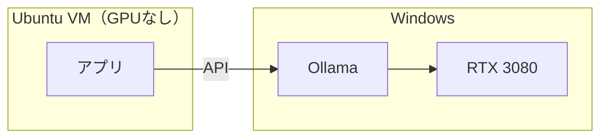
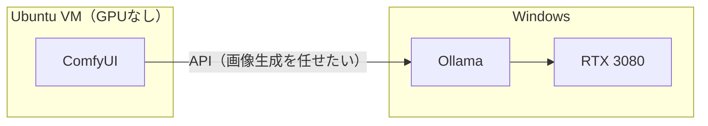
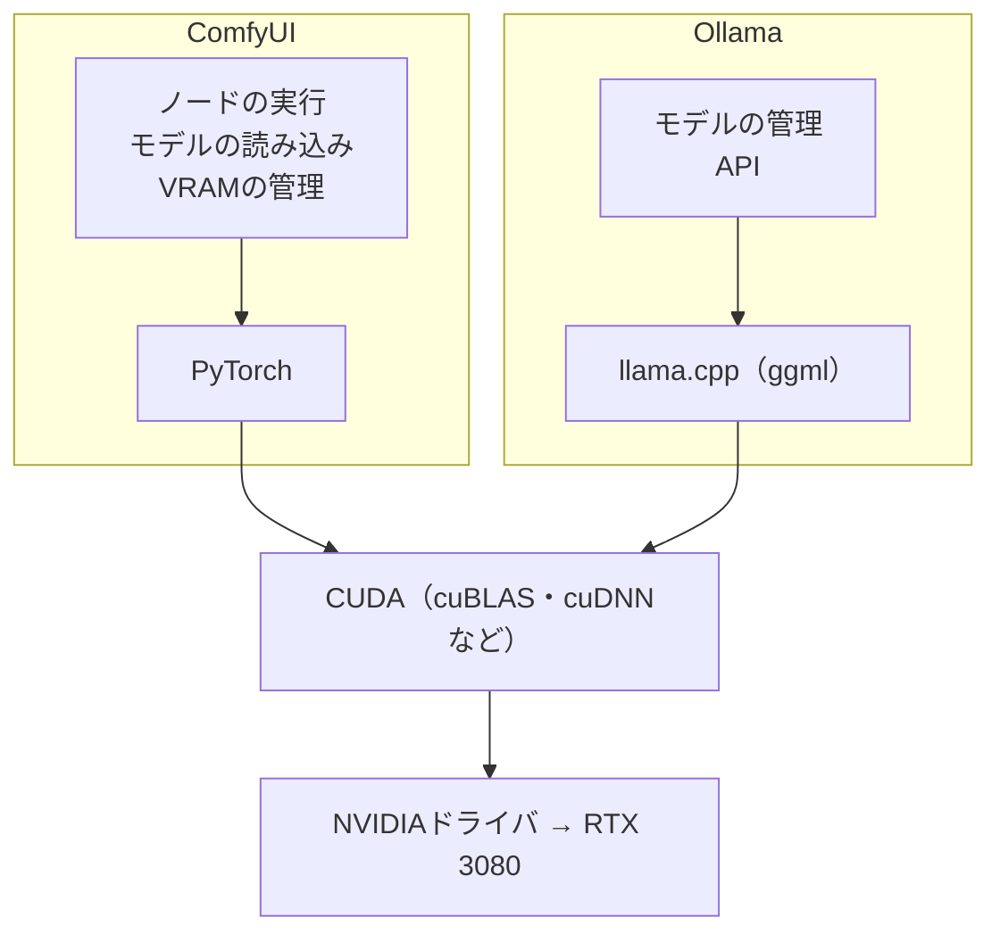
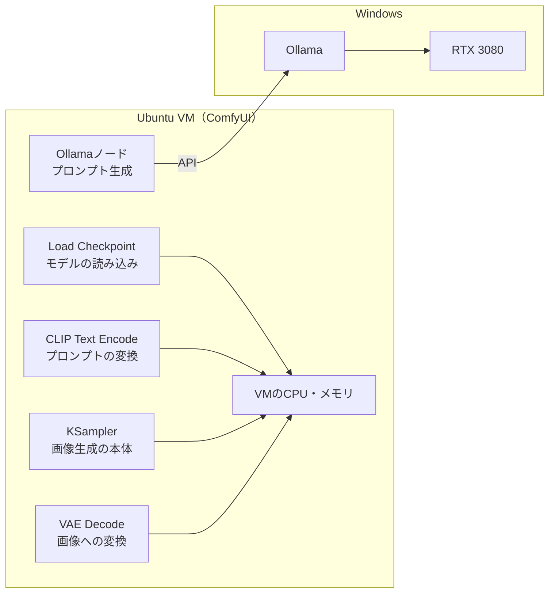
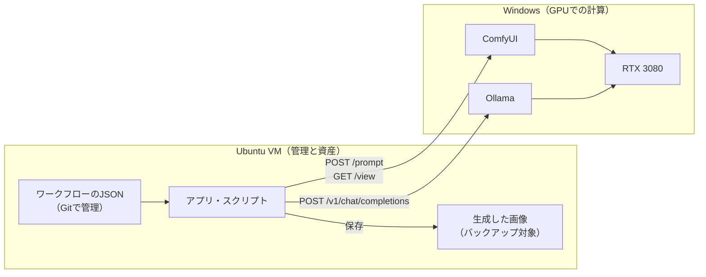
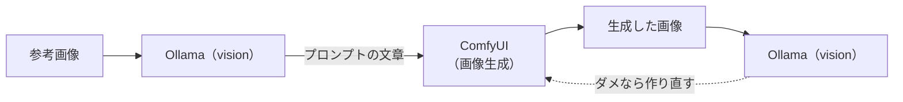

# ComfyUIをVMに置き、Ollama経由でGPUを使えるか

> 参考資料。関連：[vmware_ubuntu_dev_vm_architecture.md](../vmware_ubuntu_dev_vm_architecture.md)（§17〜19）、[ADR-0001](../adr/0001-local-llm-server-ollama.md)、[ollama-https-tailscale.md](ollama-https-tailscale.md)
> 各ソフトウェアの状況は2026-09-25時点の調査結果。

---

## 1. まとめ

| 問い | 答え |
| --- | --- |
| ComfyUIをVMに置き、Windows上のOllamaをAPIで呼んで、GPUで画像を生成できるか | **できない** |
| なぜか | ComfyUIは画像生成の計算を自分のプロセス（PyTorch）で行う。OllamaはLLMを動かすサーバーで、画像生成モデルを動かせない |
| Ollamaにvisionモデルを入れればできるか | できない。visionモデルは画像を**読む**モデルで、出力は文章 |
| Ollamaでz-image-turboを使えばできるか | できない。Ollamaの画像生成はmacOS限定の実験機能で、2026年7月に全OSから削除された |
| どう構成するか | **ComfyUIはWindowsに置き、VMからComfyUIのAPIを呼ぶ**（設計書§19のとおり） |

---

## 2. きっかけになった発想

LLMでは、GPUの無いVMから、Windows上のOllamaをAPIで呼んでGPUを使っている。

同じように、ComfyUIもVMに置き、GPUが必要な部分だけWindows上のOllamaに任せれば、ComfyUIもVMに集められるのではないか、という発想。

この発想は、**Ollamaが画像生成を実行できる**ことが前提になっている。以下で見るとおり、この前提が成り立たない。

---

## 3. 前提：VMからGPUは直接使えない

| 環境 | CUDAを使えるか | 理由 |
| --- | --- | --- |
| Windows（ホスト） | ○ | GPUのドライバが直接動いている |
| WSL2 | ○ | WindowsがGPUを仮想化して渡す仕組み（GPUの準仮想化）がある |
| VMware WorkstationのVM | **×** | GPUパススルーに対応していない。VMに見えるのは仮想のグラフィックアダプタだけ |

だから設計書では、GPUを使う処理をWindows側に集め、VMからはAPIで呼ぶ構成にしている（§17）。

---

## 4. APIは入り口、計算するのはエンジン

ComfyUIもOllamaも、APIだけのサーバーではなく、**中に計算エンジンを持つ**。どちらも自分でモデルをVRAMに載せ、CUDAで計算する。

| | ComfyUI | Ollama |
| --- | --- | --- |
| 計算に使っているもの | PyTorch | llama.cpp |
| 扱えるモデル | 画像・動画の生成モデル（Stable Diffusion、SDXL、Flux、Z-Imageなど） | LLM（文章の生成、画像の読み取り） |
| APIの役割 | 外からワークフローを受け付ける入り口 | 外から推論の依頼を受け付ける入り口 |

APIは入り口にすぎず、計算するのは中のエンジンである。したがって、

> **API経由でGPUを使えるのは、GPUのあるマシンで動くサーバーが、その処理を自分で実行できる場合だけ。**

Ollamaが実行できるのはLLMだけなので、Ollamaに任せられるのは文章の部分に限られる。

---

## 5. ComfyUIをVMに置くと、何がどこで動くか

カスタムノード [comfyui-ollama](https://github.com/stavsap/comfyui-ollama) を使えば、ComfyUIのワークフローからOllamaを呼べる。しかし、GPUで動くのはそのノードだけになる。

| ノード | 役割 | 動く場所 | GPUを使えるか |
| --- | --- | --- | --- |
| Ollamaノード（comfyui-ollama） | 短い指示から詳しいプロンプトを作る | Windows（Ollama） | ○ |
| Load Checkpoint | 画像生成モデルを読み込む | VMのメモリ | × |
| CLIP Text Encode | プロンプトをモデルが読める形に変換する | VMのCPU | × |
| KSampler | ノイズから画像を作る（計算の大半） | VMのCPU | × |
| VAE Decode | 計算結果を画像に変換する | VMのCPU | × |

一番重いKSamplerがCPUで動くため、実用的な速さにならない。

> 別のマシンのComfyUIへ処理を送るカスタムノードもある。ただしその場合もWindows側にComfyUIが要り、ComfyUIが2つになるだけで、VMに集める目的は果たせない。

---

## 6. Ollamaで画像を作れないか

### 6.1 visionモデル：画像を読むモデル

visionモデルは画像を**入力**として受け取るモデルで、**出力は文章**である。画像生成モデルとは別物。

| | visionモデル | 画像生成モデル |
| --- | --- | --- |
| 入力 | 画像＋文章 | 文章（＋参考画像） |
| 出力 | **文章** | **画像** |
| できること | 画像の説明、文字の読み取り（OCR）、画像についての質問への回答 | 文章の指示から画像を作る |
| 仕組み | 画像を細かく区切ってLLMが読める形に変換し、LLMが文章で答える | ノイズから少しずつ画像を作る（拡散モデル） |
| 例 | Gemma 3、Qwen2.5-VL、Llama 3.2 Vision、LLaVA | Stable Diffusion、SDXL、Flux、Z-Image Turbo |
| 動かすサーバー | Ollama | ComfyUI |

### 6.2 z-image-turbo：Ollamaの画像生成は削除された

Ollamaには一時期、専用の画像生成モデルを使う実験的な機能があった。

| 日付 | 出来事 |
| --- | --- |
| 2026-01-20 | 実験的な機能として公開。モデルは `x/z-image-turbo` と `x/flux2-klein`。Apple製の計算ライブラリ（MLX）の上に作られていたため、**macOS限定** |
| 2026-07-28 | 画像生成の仕組みを**すべてのOSから削除**する変更がマージされる。「将来、新しいMLXの実行部分で再導入する」とされている |
| 2026-08-24 | Windowsに対応させるプルリクエストが、マージされずに閉じられる |

調査時点では、どのOSでもOllamaで画像を作ることはできない。

### 6.3 将来Ollamaに戻ってきたとしても

WindowsのOllamaで画像生成が使えるようになっても、ComfyUIをVMに置く理由にはなりにくい。

| 観点 | 内容 |
| --- | --- |
| ComfyUIの役割 | Ollamaに画像生成を頼むだけの画面になり、ComfyUIのエンジンを使わなくなる |
| 失う機能 | LoRA、ControlNet、インペイント（画像の一部だけ描き直す機能）、サンプラーの細かい設定などは、ComfyUI自身のエンジンが実行する機能で、Ollamaには任せられない |
| もっと簡単な方法 | 公開されたときのOllamaの画像生成は、少なくとも「文章から画像を作る」だけの機能だった。それだけならComfyUIを通さず、アプリからOllamaを直接呼べばよい |

なお、z-image-turboもFLUX.2 KleinもComfyUIが標準で対応しており、公式のワークフロー例もある。使いたいならComfyUIで動かすのが早い。

---

## 7. 補足：ComfyUIが外部のAPIを使えないわけではない

Ollamaで画像を作れないのは、**Ollamaの側に画像を生成する機能が無い**からで、ComfyUIが外部のAPIを使えないからではない。

| 方法 | 内容 |
| --- | --- |
| API Nodes（公式） | OpenAIやBlack Forest Labs（Flux）など、有料のクラウドの画像生成サービスをノードとして呼べる |
| カスタムノード | 任意のHTTP APIを呼ぶノードを作れる。comfyui-ollamaもその1つ |

---

## 8. 結論の構成

ComfyUIはWindowsに置き、VMからComfyUIのAPIを呼ぶ。画像生成について、ComfyUIはLLMにおけるOllamaと同じ役割を果たす。

| | 文章（LLM） | 画像生成 |
| --- | --- | --- |
| Windowsで動いてGPUを使うサーバー | Ollama | **ComfyUI** |
| VMからの呼び方 | `POST /v1/chat/completions` | `POST /prompt` など |

### 置き場所

| 置き場所 | 置くもの | 理由 |
| --- | --- | --- |
| VM | 呼び出すアプリ・スクリプト | 開発の作業場所はVMに一本化している |
| VM | ワークフローのJSON（API形式） | Gitで管理でき、VMのバックアップ対象にもなる |
| VM | 生成した画像 | APIで取得して保存すれば、バックアップ対象がVMに集まる |
| Windows | ComfyUI本体・モデルファイル | GPUで計算するエンジンそのもの |
| Windows | Ollama本体・モデル | 同上 |

Windowsに残るのは実行環境だけで、壊れても入れ直せば済む。

### VMから使うComfyUIのAPI

| API | 用途 |
| --- | --- |
| `POST /prompt` | ワークフロー（API形式のJSON）を送って実行する |
| `WebSocket /ws` | 実行の進み具合と完了を受け取る |
| `GET /history/{prompt_id}` | 実行結果（出力された画像のファイル名など）を取得する |
| `GET /view` | 生成した画像を取得する |
| `POST /free` | 読み込んでいるモデルをVRAMから降ろす |

### VRAMの取り合い

ComfyUIとOllamaは、それぞれ自分でモデルをVRAMに載せる。同じRTX 3080（10GB）を使うので、同時に大きなモデルを載せることはできない。使っていない側のモデルを降ろしてから使う。

| 降ろす側 | 方法 |
| --- | --- |
| Ollama | 既定で5分使われなければ降りる。すぐ降ろすなら `keep_alive` を `0` にする |
| ComfyUI | `POST /free` に `{"unload_models": true, "free_memory": true}` を送る |

---

## 9. 補足：OllamaとComfyUIの組み合わせ方

Ollamaは画像生成の代わりにはならないが、ComfyUIと組み合わせると役に立つ。comfyui-ollamaには、visionモデルを使うノードもある。

| 使い方 | 内容 |
| --- | --- |
| 画像からプロンプトを作る | 参考画像を見せて「この画風を画像生成用のプロンプトにして」と頼む |
| 生成した画像を確認する | 「指示どおりの構図か」「文字が崩れていないか」を判定させ、ダメなら作り直す |
| 説明文を付ける | 生成した画像に説明文やタグを付けて整理する |

どれもOllamaとComfyUIが同じGPUを使うので、同時には動かさず交互に使う。

---

## 参考

- Ollama
  - [ollama/ollama PR #16615](https://github.com/ollama/ollama/pull/16615)（画像生成の削除）
  - [ollama/ollama PR #13806](https://github.com/ollama/ollama/pull/13806)（Windows対応、マージされずに終了）
  - [Ollama Image Generation: Run Z-Image & FLUX.2 Locally (2026)](https://localaimaster.com/blog/ollama-image-generation-models)
- ComfyUI
  - [Z-Image-Turbo ComfyUI Workflow Example](https://docs.comfy.org/tutorials/image/z-image/z-image-turbo)
  - [FLUX.2 [klein] | Comfy with ComfyUI](https://comfyui.nomadoor.net/en/basic-workflows/flux-2-klein/)
  - [stavsap/comfyui-ollama](https://github.com/stavsap/comfyui-ollama)
- VMware Workstation
  - [VMware Workstation GPU Passthrough: What Works and What Doesn't](https://www.cloudspress.com/vmware-workstation-graphics-card-passthrough/)
  - [GPU Passthrough for VMware Workstation Pro（Broadcom Community）](https://community.broadcom.com/vmware-cloud-foundation/question/gpu-passthrough-for-vmware-workstation-pro)
