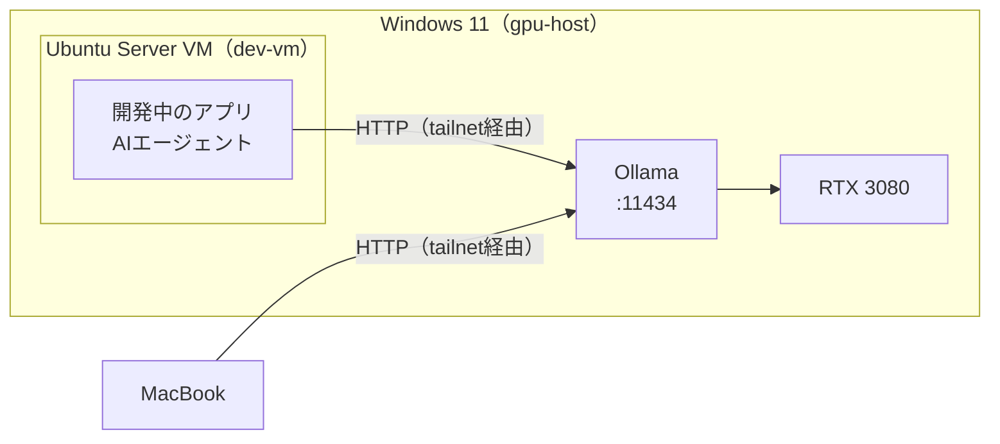
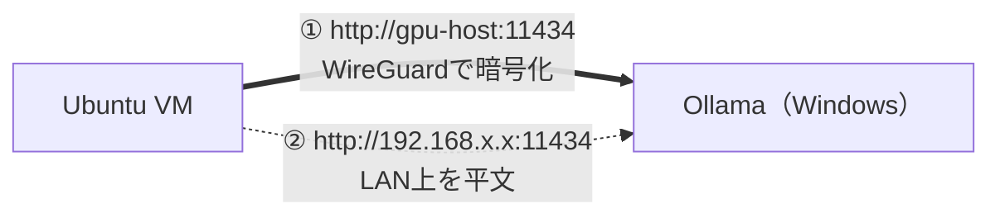
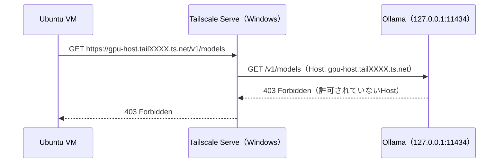
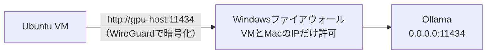
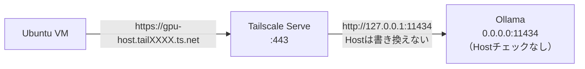
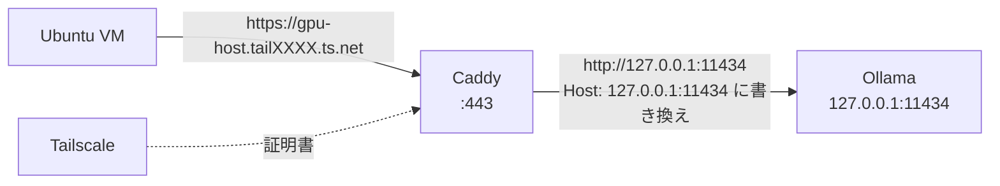
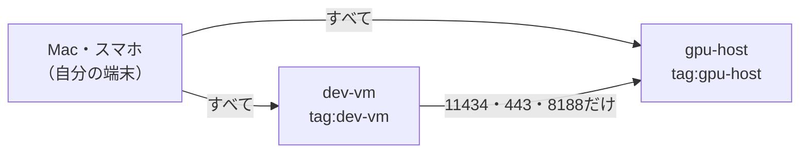

# OllamaのHTTPS化とTailscaleの設定

> 参考資料。Ollamaを採用した経緯は [ADR-0001](../adr/0001-local-llm-server-ollama.md) を参照。
> 各ソフトウェアの挙動は2026-09-25時点の調査結果。

このドキュメントでは、次の名前を例として使う。

| 例 | 意味 |
| --- | --- |
| `gpu-host` | WindowsホストのTailscale上のマシン名 |
| `dev-vm` | Ubuntu Server VMのTailscale上のマシン名 |
| `tailXXXX.ts.net` | tailnetのDNS名（管理コンソールのDNSページで確認できる） |
| `gpu-host.tailXXXX.ts.net` | WindowsホストのFQDN（HTTPSの証明書はこの名前に対して発行される） |

---

## 1. まとめ

| 問い | 答え |
| --- | --- |
| Ollama単体でHTTPSにできるか | **できない**。証明書を指定する設定がない。HTTPSにするには前にリバースプロキシを置く |
| 今の構成でHTTPS化は必要か | **不要**。VMからWindowsへの通信はTailscale（WireGuard）で暗号化されている |
| 必要になったらどうするか | Tailscale Serve（パターンB）か、Caddy（パターンC） |
| 一番の落とし穴 | Ollamaを `127.0.0.1` で待ち受けさせたままTailscale Serveを使うと **403 Forbidden** になる |

---

## 2. 前提の構成



VMはWindowsの中で動いているが、Bridgedネットワークで**LAN上の別の1台**として振る舞う。VMからOllamaへの通信は、同じPCの中であってもネットワークを通る。

---

## 3. 通信はすでに暗号化されている

VMからOllamaを呼ぶ経路は2つある。



| 呼び方 | 例 | 暗号化 | 使うか |
| --- | --- | --- | --- |
| Tailscaleの名前 | `http://gpu-host:11434` | ○ WireGuard | **使う** |
| TailscaleのIP | `http://100.x.x.x:11434` | ○ WireGuard | 使ってよい |
| LANのIP | `http://192.168.x.x:11434` | × 平文 | **使わない**（ファイアウォールで塞ぐ） |

Tailscaleは端末どうしの通信をWireGuardで暗号化する。URLが `http://` でも、Tailscaleの名前かIPで呼んでいる限り、経路の途中で中身は読めない。暗号化だけが目的なら、HTTPS化は要らない。

---

## 4. HTTPSが必要になる場面

| 場面 | 理由 |
| --- | --- |
| `https://` のURLしか受け付けないツールを使う | 設定の時点で弾かれる |
| httpsのページで動くブラウザのツールから呼ぶ | ブラウザが、httpsのページからのhttp接続（混在コンテンツ）をブロックする |
| 接続先が本物のサーバーであることを証明書で確かめたい | WireGuardでも相手の端末は確認されるが、アプリの側からは見えない |

---

## 5. Ollamaの待ち受けとHostヘッダーのチェック

HTTPS化でつまずく原因はここにある。

### 5.1 `OLLAMA_HOST` の値と挙動

| `OLLAMA_HOST` | 待ち受け先 | 届く相手 | Hostヘッダーのチェック | 備考 |
| --- | --- | --- | --- | --- |
| 未設定（`127.0.0.1:11434`） | Windows自身だけ | Windows上のプロセスだけ | **有効** | VMからは届かない |
| `0.0.0.0` | すべてのネットワーク | LAN・tailnet（ファイアウォール次第） | 無効 | 今回の計画（パターンA・B） |
| `100.x.x.x`（TailscaleのIP） | tailnetだけ | tailnetの端末 | 無効 | Tailscaleより先にOllamaが起動すると待ち受けに失敗する。非推奨 |

### 5.2 Hostヘッダーのチェックとは

Ollamaは、**ループバック（`127.0.0.1`）で待ち受けているときだけ**、要求のHostヘッダーを確認し、次のもの以外を403で拒否する。DNSリバインディング攻撃（悪意のあるWebページから、ブラウザ経由でlocalhostのOllamaを呼ばせる攻撃）への対策である。

| Hostヘッダー | 結果 |
| --- | --- |
| `localhost`、空 | ○ 通る |
| ループバック・プライベートIP・自分のネットワークアダプタのIP（例：`127.0.0.1`） | ○ 通る |
| Windowsのコンピューター名 | ○ 通る |
| `*.localhost` / `*.local` / `*.internal` | ○ 通る |
| `gpu-host.tailXXXX.ts.net` | **× 403 Forbidden** |

Tailscale Serveは、受け取ったHostヘッダー（`gpu-host.tailXXXX.ts.net`）を**書き換えずに**Ollamaへ渡す。そのため次のようになる。



回避するには、Ollamaを `0.0.0.0` で待ち受けさせてチェックを外す（パターンB）か、途中でHostヘッダーを書き換える（パターンC）。

> なお `OLLAMA_ORIGINS` はブラウザ向けのCORS（Originヘッダー）の設定で、このHostヘッダーのチェックとは別物。設定しても403は解消しない。

---

## 6. 構成パターン

| | A. HTTPのまま（推奨） | B. Tailscale Serve | C. Caddy | D. Serve＋localhost |
| --- | --- | --- | --- | --- |
| VMから呼ぶURL | `http://gpu-host:11434` | `https://gpu-host.tailXXXX.ts.net` | 同左 | 同左 |
| 暗号化 | WireGuard | WireGuard＋TLS | WireGuard＋TLS | － |
| `OLLAMA_HOST` | `0.0.0.0` | `0.0.0.0` | 未設定（`127.0.0.1`） | 未設定 |
| 追加で動かすもの | なし | なし（Tailscaleの機能） | Caddy | － |
| 認証を足せるか | × | × | ○ | － |
| 届く相手の制御 | Windowsファイアウォール | Tailscale ACL | Windowsファイアウォール | － |
| 手間 | ◎ | ○ | △ | － |
| 結果 | 動く | 動く | 動く | **403で動かない** |

### パターンA：HTTPのまま（推奨）



ROADMAPのStep 6の構成そのもの。追加の設定は無い。

### パターンB：Tailscale Serve



TailscaleがHTTPSの証明書を自動で取得・更新し、`:443` で受けた要求をOllamaへ転送する。Ollamaが `0.0.0.0` で待ち受けているので、Hostヘッダーのチェックは働かない。

### パターンC：Caddy



Caddyが、`*.ts.net` の証明書をTailscaleから自動で取得する。Hostヘッダーを書き換えて転送するので、OllamaはWindows自身からしか届かない `127.0.0.1` のままにできる。トークンを持たない要求を拒否する設定も足せる（Ollamaに無い認証を補える）。

---

## 7. 設定手順

### 7.1 Ollama（Windows）

インストーラー版ではなく、GitHubのリリースにある `ollama-windows-amd64.zip`（CLIとGPUライブラリのみ）を使う。インストーラー版はログイン後にトレイアプリとして起動し、タスクスケジューラから起動したものとポートが衝突するため。

環境変数は、システム全体ではなく起動スクリプトの中で設定する。システム環境変数にすると、SSHから打つ `ollama list` などのCLIも同じ `OLLAMA_HOST` を接続先として読んでしまう。

```powershell
# C:\ollama\start-ollama.ps1
# タスクスケジューラから実行する

$env:OLLAMA_HOST           = "0.0.0.0"   # パターンA・B。パターンCではこの行を消す
$env:OLLAMA_CONTEXT_LENGTH = "32768"     # 既定の4kでは足りない（ADR-0001）
$env:OLLAMA_KV_CACHE_TYPE  = "q8_0"      # KVキャッシュのVRAMを半分にする（ADR-0001）

& "C:\ollama\ollama.exe" serve
```

| 環境変数 | 値 | 意味 |
| --- | --- | --- |
| `OLLAMA_HOST` | `0.0.0.0` | すべてのネットワークで待ち受ける。Hostヘッダーのチェックも外れる |
| `OLLAMA_CONTEXT_LENGTH` | `32768` | 一度に扱えるトークン数 |
| `OLLAMA_KV_CACHE_TYPE` | `q8_0` | KVキャッシュの精度。`f16`（既定）の半分のメモリで済む |
| `OLLAMA_KEEP_ALIVE` | 既定（`5m`） | 使われなくなってから、モデルをVRAMから降ろすまでの時間 |
| `OLLAMA_ORIGINS` | 必要なときだけ | ブラウザから呼ぶときに許可するOrigin（CORS） |

タスクスケジューラへの登録（ROADMAPのStep 6・7）：

| 項目 | 設定 |
| --- | --- |
| トリガー | コンピューターの起動時 |
| 操作 | `powershell.exe -NoProfile -ExecutionPolicy Bypass -File C:\ollama\start-ollama.ps1` |
| セキュリティオプション | ユーザーがログオンしているかどうかにかかわらず実行する |

### 7.2 Windowsファイアウォール（パターンA・B）

受け付ける相手を、tailnet全体（`100.64.0.0/10`）ではなく、**VMとMacのTailscale IPだけ**に絞る。Ollamaには認証が無いので、届く相手を減らすことが唯一の防御になる。

TailscaleのIPは、各端末で `tailscale ip -4` を実行すると分かる。端末を登録し直さない限り変わらない。

```powershell
# 管理者のPowerShellで実行する
$vm  = "100.x.x.x"   # dev-vm で `tailscale ip -4` を実行した結果
$mac = "100.y.y.y"   # Mac で `tailscale ip -4` を実行した結果

# 新しく作る場合
New-NetFirewallRule -DisplayName "Ollama (tailnet)" -Direction Inbound -Protocol TCP `
  -LocalPort 11434 -RemoteAddress $vm, $mac -Action Allow

# ROADMAPの手順で作成済みの場合は、許可元だけ変える
Set-NetFirewallRule -DisplayName "Ollama (tailnet)" -RemoteAddress $vm, $mac

# ollama.exe を丸ごと許可するルールが無いか確認する
# （初回起動時のダイアログで「許可」を押すと作られ、上の絞り込みが無意味になる）
Get-NetFirewallApplicationFilter | Where-Object Program -like "*ollama*" |
  Get-NetFirewallRule | Format-Table DisplayName, Enabled, Direction, Action
```

パターンBで、すべての端末がHTTPS（Serve経由）で呼ぶようになったら、このルールは削除してよい。ServeからOllamaへの転送はWindowsの中（`127.0.0.1`）で完結するため。

### 7.3 Tailscale（管理コンソール）

| 設定 | 場所 | 必要なパターン | 補足 |
| --- | --- | --- | --- |
| MagicDNS を有効にする | DNS | すべて | `gpu-host` のような短い名前で届くようになる |
| Key expiry を無効にする | Machines → 各マシン | すべて | 常時稼働の端末が期限切れで切断されないようにする |
| マシン名を変える | Machines → Edit machine name | B・C | マシン名が証明書の公開ログに載るため、個人を特定できない名前（例：`gpu-host`）にする |
| HTTPS Certificates を有効にする | DNS → Enable HTTPS | B・C | MagicDNSが前提 |
| ACL（アクセス制御） | Access controls | 任意 | 7.4を参照 |

> **証明書の公開ログについて**：TLS証明書はすべて Certificate Transparency という公開ログに記録され、誰でも検索できる。HTTPSを有効にすると `gpu-host.tailXXXX.ts.net` という名前が公開される。tailnetの持ち主は分からないが、マシン名そのものは見える。

### 7.4 Tailscale ACL（任意）

既定のポリシーはtailnet内の全端末どうしを全ポートで通す。パターンBではWindowsファイアウォールではなく、ここで届く相手を絞る。



```jsonc
{
  "tagOwners": {
    "tag:gpu-host": ["autogroup:admin"],
    "tag:dev-vm":   ["autogroup:admin"]
  },
  "grants": [
    // 自分の端末（Mac・スマホ）どうし
    { "src": ["autogroup:member"], "dst": ["autogroup:self"], "ip": ["*"] },
    // 自分の端末から、WindowsとVMへ（SSH・Ollama・ComfyUI）
    { "src": ["autogroup:member"], "dst": ["tag:gpu-host", "tag:dev-vm"], "ip": ["*"] },
    // VMからWindowsへは、Ollama（HTTP・Serve）とComfyUIだけ
    { "src": ["tag:dev-vm"], "dst": ["tag:gpu-host"], "ip": ["tcp:11434", "tcp:443", "tcp:8188"] }
  ]
}
```

| 注意点 | 内容 |
| --- | --- |
| 既定のルールを置き換える | 既定の全許可のルール（`grants` なら `"src": ["*"], "dst": ["*"]`、古い `acls` 形式なら `"dst": ["*:*"]`）を消さないと、絞り込みにならない |
| タグの付け方 | Machines → 各マシンのメニュー → Edit tags |
| タグを付けた端末 | ユーザーではなくタグの持ち物になる。鍵の期限切れも既定で無効になる |
| 間違えたとき | ACLは管理コンソール（Web）からいつでも直せる。保存したら、すぐにMacから `ssh win` と `ssh dev-vm`、VMから `curl` を試す |

### 7.5 パターンB：Tailscale Serve

1. 7.3の「マシン名を変える」「HTTPS Certificates を有効にする」を済ませる
2. `start-ollama.ps1` で `OLLAMA_HOST=0.0.0.0` になっていることを確認する
3. Windowsの管理者のPowerShellで、Serveを設定する

```powershell
# 443番（HTTPS）で受けて、http://127.0.0.1:11434 に転送する
# --bg を付けると、Windowsの再起動後も自動で復帰する
tailscale serve --bg 11434

# 状態を確認する
tailscale serve status
```

| 操作 | コマンド |
| --- | --- |
| 公開する | `tailscale serve --bg 11434` |
| 状態を見る | `tailscale serve status` |
| 公開をやめる | `tailscale serve --https=443 off` |
| 設定をすべて消す | `tailscale serve reset` |

HTTPSがまだ有効でない場合は、コマンドが有効化用のURLを表示して止まる。初回のアクセスは証明書の取得で時間がかかることがある。

### 7.6 パターンC：Caddy

> Windows上のCaddyがTailscaleから証明書を取得するには、Caddyを管理者権限で動かすか、取得の権限を与える必要がある。Windowsでの具体的な手順は未検証。

1. `start-ollama.ps1` から `OLLAMA_HOST` の行を消す（`127.0.0.1` で待ち受ける）
2. 7.2の11434番のルールを削除し、代わりに443番をVMとMacのIPだけに許可する
3. Caddyfileを書く

```caddyfile
# C:\caddy\Caddyfile
gpu-host.tailXXXX.ts.net {
	# 任意：トークンを持たない要求を拒否する
	@noauth not header Authorization "Bearer {$OLLAMA_PROXY_TOKEN}"
	respond @noauth 401

	reverse_proxy 127.0.0.1:11434 {
		# 既定では元のHostヘッダーがそのまま渡り、Ollamaに403で拒否される
		header_up Host {upstream_hostport}
	}
}
```

4. タスクスケジューラから `caddy run --config C:\caddy\Caddyfile` を起動時に実行する（Ollamaと同じ設定）

ストリーミングの応答は、Caddyが自動で即時に転送するので、追加の設定は要らない。

### 7.7 VM側

アプリのプロジェクトごとの `.env` に書く。

```dotenv
# パターンA
OPENAI_BASE_URL=http://gpu-host:11434/v1
# パターンB・C
# OPENAI_BASE_URL=https://gpu-host.tailXXXX.ts.net/v1

# Ollamaは値を確認しないが、OpenAIのSDKは空だとエラーになる
# パターンCでトークン認証を足した場合は、そのトークンを入れる
OPENAI_API_KEY=ollama
```

**シェル全体（`~/.bashrc` など）には書かない。** OpenAIのSDKを使う他のツール（Codex CLIなど）の接続先や認証まで変わってしまうおそれがある。ROADMAPで `ANTHROPIC_API_KEY` を残さないようにしているのと同じ理由。

---

## 8. 確認コマンド

| 確認すること | 実行する場所 | コマンド | 期待する結果 |
| --- | --- | --- | --- |
| Ollamaが動いている | Windows | `curl.exe http://127.0.0.1:11434/api/version` | バージョンのJSON |
| 待ち受けアドレス | Windows | `netstat -ano \| findstr :11434` | A・Bは `0.0.0.0:11434`、Cは `127.0.0.1:11434` |
| Hostヘッダーのチェック | Windows | `curl.exe -i -H "Host: example.ts.net" http://127.0.0.1:11434/api/version` | `127.0.0.1` で待ち受けていれば403、`0.0.0.0` なら200 |
| VMから届く（A） | VM | `curl http://gpu-host:11434/v1/models` | モデル一覧 |
| VMから届く（B・C） | VM | `curl https://gpu-host.tailXXXX.ts.net/v1/models` | モデル一覧（証明書エラーが出ない） |
| LANのIPでは届かない | VM | `curl -m 5 http://<WindowsのLANのIP>:11434/api/version` | タイムアウト |
| Serveの設定 | Windows | `tailscale serve status` | `https://gpu-host.tailXXXX.ts.net` から `http://127.0.0.1:11434` への転送 |

Windows PowerShell 5.1では `curl` が `Invoke-WebRequest` の別名になっているので、`curl.exe` と拡張子まで書く。

---

## 9. うまくいかないとき

| 症状 | 原因 | 対処 |
| --- | --- | --- |
| HTTPSで呼ぶと `403 Forbidden` | Ollamaが `127.0.0.1` で待ち受けていて、Hostヘッダーのチェックに弾かれている | `OLLAMA_HOST=0.0.0.0`（パターンB）にするか、Hostヘッダーを書き換える（パターンC） |
| `https://gpu-host/` で証明書エラー | 証明書はFQDN（`gpu-host.tailXXXX.ts.net`）に対して発行されている | HTTPSではFQDNで呼ぶ |
| VMから届かない（タイムアウト） | Ollamaが `127.0.0.1` で待ち受けている、ファイアウォールかACLで弾かれている | 8の「待ち受けアドレス」を確認し、7.2・7.4の許可元を見直す |
| ブラウザのツールからだけCORSエラー | ツールのOriginが許可されていない | `OLLAMA_ORIGINS` にツールのOriginを追加する |
| `tailscale serve` がURLを表示して止まる | tailnetでHTTPSが有効になっていない | 表示されたURLか、管理コンソールのDNSページで有効にする |
| 再起動するとServeが消える | `--bg` を付けずに実行した | `tailscale serve --bg 11434` で設定し直す |
| 応答が途中まで来て止まる、遅い | VRAMが足りずモデルの一部がCPUで動いている（HTTPS化とは無関係） | `ollama ps` で `100% GPU` になっているか確認する |

---

## 参考

- Ollama
  - [FAQ](https://docs.ollama.com/faq)（`OLLAMA_HOST`、`OLLAMA_ORIGINS` など）
  - [OpenAI compatibility](https://docs.ollama.com/api/openai-compatibility)
  - [server/routes.go](https://github.com/ollama/ollama/blob/main/server/routes.go)（Hostヘッダーのチェック：`allowedHostsMiddleware`）
- Tailscale
  - [Tailscale Serve](https://tailscale.com/kb/1312/serve)
  - [tailscale serve command](https://tailscale.com/kb/1242/tailscale-serve)
  - [Enabling HTTPS](https://tailscale.com/kb/1153/enabling-https)
  - [Grants](https://tailscale.com/kb/1324/grants)
  - [Tags](https://tailscale.com/kb/1068/tags)
- Caddy
  - [Automatic HTTPS](https://caddyserver.com/docs/automatic-https)（Tailscaleとの連携）
  - [reverse_proxy](https://caddyserver.com/docs/caddyfile/directives/reverse_proxy)
- 解説記事
  - [Ollama behind a reverse proxy with Caddy or Nginx for HTTPS streaming](https://www.glukhov.org/llm-hosting/ollama/ollama-behind-reverse-proxy/)
  - [Remote Ollama access via Tailscale or WireGuard, no public ports](https://www.glukhov.org/llm-hosting/ollama/ollama-remote-access/)
