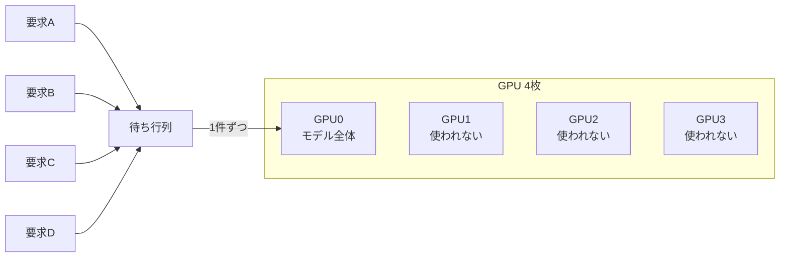
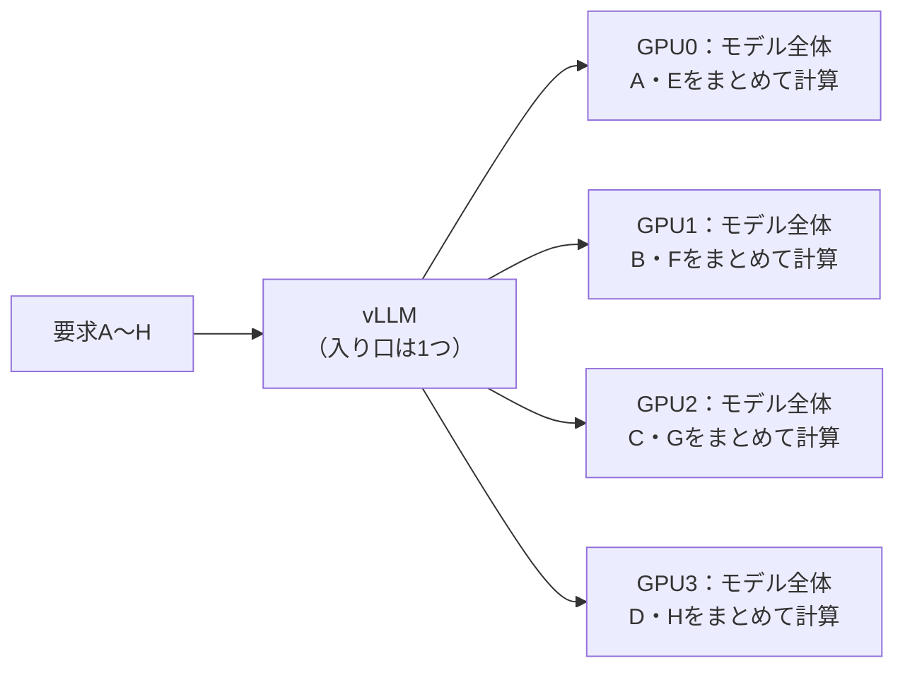
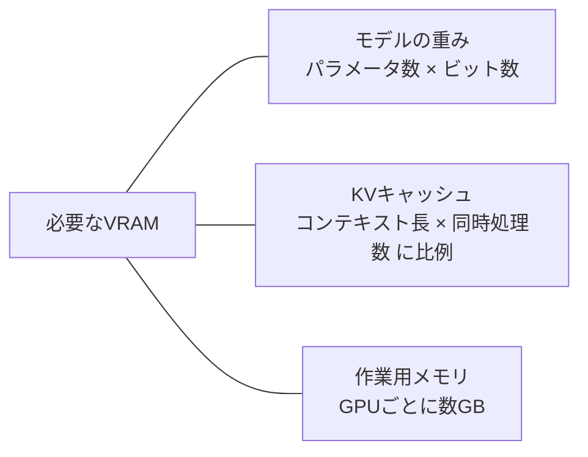

# 複数人で使うLLMサーバー：OllamaとvLLMの違い

> 参考資料。自宅の構成ではなく、実務で使った共有ワークステーションの振り返り。
> 自宅でOllamaを選んだのは「使うのが1人だけ」だから（[ADR-0001](../adr/0001-local-llm-server-ollama.md)）で、このドキュメントの前提（部署の複数人で共有）とは逆になる。
> 各ソフトウェアの挙動は2026-09-25時点の調査結果。サイズや速度の数値は目安。

---

## 1. まとめ

| 問い | 答え |
| --- | --- |
| 同時に多数のリクエストが来る環境では、vLLMのほうが向いているか | **向いている**。同時に1件なら差はほぼ無く、同時の要求が増えるほど差が開く |
| Ollamaで、複数GPUでの同時処理が遅かったのはなぜか | 同じモデルの同時処理数が既定で1件。モデルが1枚に収まれば1枚にしか載せない。収まらなければ層で分けて、GPUが順番に計算する |
| VRAM 192GBなのに、70BのQ4_K_Mが限界だったのはなぜか | **ハードウェアの限界ではない**。VRAMの量から自動で決まる既定のコンテキスト長（256k）により、KVキャッシュが膨らんだ可能性が高い |
| vLLMにすれば、載せられるモデルは大きくなるか | **ほとんど変わらない**。変わるのは、重みを載せた残りのVRAMの使い方（同時にさばける量） |

---

## 2. 当時の環境と症状

| 項目 | 内容 |
| --- | --- |
| GPU | RTX 6000 Ada（VRAM 48GB）× 4枚 ＝ 合計192GB。GPUどうしを高速につなぐNVLinkは無く、PCIe経由 |
| サーバー | Ollama。Modelfileを作ってモデルを登録 |
| 利用者 | 部署内の、同じネットワークにあるPC |
| 症状1 | 複数のリクエストが同時に来ると遅い |
| 症状2 | 70BのQ4_K_Mより大きいモデル（Q8・FP16など）は、読み込めないか極端に遅い |
| 観察 | 70BのQ4_K_Mを動かしているとき、複数のGPUが使われていた |

---

## 3. 同時処理：Ollamaが遅かった理由

### 3.1 原因

| 原因 | 内容 |
| --- | --- |
| **同時処理数が既定で1件** | `OLLAMA_NUM_PARALLEL` の既定値は1（版によって違い、以前は4などだった）。超えた要求は待ち行列に入り、順番に処理される |
| **1枚に収まるモデルは1枚にだけ載せる** | GPU間の転送を避けるため。4枚あっても、残りの3枚は使われない |
| **収まらないモデルは層で分けて、順番に計算する** | 1トークン作るたびに GPU0→1→2→3 と順に計算する。同時に働くGPUは常に1枚で、4枚あっても4倍速にはならない |
| **同時処理数を上げても伸びにくい** | 同時処理の仕組みそのものが、多数の要求をまとめてさばく作りになっていない（3.4） |

### 3.2 Ollamaの動き

モデルが1枚に収まる場合：



モデルが1枚に収まらない場合（層で分割）：


`nvidia-smi` では4枚とも「使われている」ように見えるが、実際は交代で動いていて、同時に計算しているのは1枚だけ。

### 3.3 vLLMの動き（データ並列の場合）



vLLMが同時処理に強い理由：

| 仕組み | 内容 |
| --- | --- |
| 連続バッチ処理 | 1トークン生成するたびに、新しく来た要求を処理中のまとまり（バッチ）に加える。GPUはまとめて計算するほど効率が上がるため、同時の要求が増えても全体の処理量が伸びる |
| PagedAttention | KVキャッシュ（会話の途中経過を保存するメモリ）を小さな単位で管理し、実際に使った分だけ割り当てる。無駄が減り、同時に多くの要求を載せられる |
| 複数GPUの使い分け | データ並列・テンソル並列・パイプライン並列から選べる（4章） |
| 共通部分の再利用 | 同じシステムプロンプトで始まる要求の計算結果を使い回す。Modelfileでシステムプロンプトを決めて全員で使う場合に効く |

### 3.4 性能の比較

Red Hatによる比較（A100 1枚、同じモデル）：

| 同時の要求数 | Ollama | vLLM |
| --- | --- | --- |
| 1 | ほぼ同じ | ほぼ同じ |
| 256 | 毎秒41トークン | **毎秒793トークン** |
| 補足 | `OLLAMA_NUM_PARALLEL=32` まで上げても、どの同時数でもvLLMに大きく届かなかった | 同時数に比例するように伸びた |

---

## 4. vLLMでの複数GPUの使い方

### 4.1 3つの分け方

| 分け方 | 分け方の中身 | GPU間の通信 | 向いている場面 |
| --- | --- | --- | --- |
| データ並列 | 各GPUにモデル全体を載せ、要求を振り分ける | ほぼ無い | モデルが1枚（またはGPUの組）に収まり、同時処理を増やしたい |
| テンソル並列 | 各層の計算を分担し、全GPUが同時に計算する | 多い（層ごとに結果を集める） | モデルが1枚に収まらず、NVLinkでつながっている |
| パイプライン並列 | 層ごとに分担する | 少ない | モデルが1枚に収まらず、NVLinkが無い |

RTX 6000 AdaにはNVLinkが無い。vLLMの公式ドキュメントは、NVLinkの無いGPU（同世代のデータセンター向けGPUであるL40Sが例）では、テンソル並列よりパイプライン並列を勧めている。

### 4.2 モデルの大きさ別の構成

| モデルの大きさ | 構成 | 起動の例 |
| --- | --- | --- |
| 1枚（48GB）に収まる | データ並列 4 | `vllm serve <モデル> --data-parallel-size 4` |
| 2枚あれば収まる | 2枚1組を2つ | `vllm serve <モデル> --data-parallel-size 2 --tensor-parallel-size 2` |
| 4枚すべて必要 | パイプライン並列 4 | `vllm serve <モデル> --pipeline-parallel-size 4` |

- データ並列にしても入り口は1つで、要求は内部で各GPUに振り分けられる
- 「2枚1組」の組の中をテンソル並列にするかパイプライン並列にするかは、PCIe接続なので実際に測って決める

例：70BのFP8（重み約70GB）を、2枚1組×2で動かす。

```bash
vllm serve <70BのFP8モデル> \
  --data-parallel-size 2 \
  --tensor-parallel-size 2 \
  --max-model-len 32768 \
  --kv-cache-dtype fp8 \
  --api-key <部署で共有するキー>
```

---

## 5. VRAM：70BのQ4_K_Mが限界に見えた理由

### 5.1 192GBには、もっと大きいモデルが載る

モデルの重さは、おおよそ「パラメータ数 × 量子化のビット数 ÷ 8」。以下はOllamaのライブラリにあるファイルサイズを目安にしている。

| モデル | 量子化 | 重みのサイズ | 192GBに載るか |
| --- | --- | --- | --- |
| Llama 3.3 70B | Q4_K_M | 約43GB | ○（1枚に収まる） |
| Llama 3.3 70B | Q8_0 | 約75GB | ○ |
| Llama 3.3 70B | FP16 | 約141GB | ○ |
| gpt-oss-120b | MXFP4 | 約65GB | ○ |
| Mistral Large（123B） | Q4_K_M | 約73GB | ○ |
| Qwen3-235B-A22B | Q4_K_M | 約142GB | ○ |
| Llama 3.1 405B | Q4_K_M | 約243GB | × |
| DeepSeek-R1（671B） | Q4_K_M | 約404GB | × |

「70BのQ4_K_Mが限界」は、192GBの限界ではない。

### 5.2 VRAMに載るもの



Ollama（中身のllama.cpp）は、KVキャッシュを「コンテキスト長 × 同時処理数」分、**読み込み時にまとめて確保する**。

Llama 3.3 70BのKVキャッシュ（FP16）は、1トークンあたり次のとおり。

```text
2（KとV）× 80層 × 8（KVヘッド数）× 128（ヘッドの次元）× 2バイト ＝ 約0.31MB
```

| コンテキスト長 | 同時1件 | 同時4件 |
| --- | --- | --- |
| 8k | 約2.5GB | 約10GB |
| 32k | 約10GB | 約40GB |
| 128k | 約40GB | 約160GB |
| 256k | 約80GB | 約320GB |

### 5.3 有力な原因：既定のコンテキスト長がVRAMの量で決まる

Ollamaは **v0.15.5（2026年2月3日）** から、コンテキスト長の既定値を、GPUの合計VRAMから自動で決めるようになった。

| 合計VRAM | 既定のコンテキスト長 |
| --- | --- |
| 24GB未満 | 4k |
| 24〜48GB | 32k |
| **48GB以上** | **256k（262,144トークン）** |

RTX 6000 Ada ×4は合計192GBなので、**何も設定しなくても256kのコンテキストが確保される**。しかもこの自動設定は同時処理数を考慮しない。「VRAMを使い果たしてシステムメモリにはみ出し、極端に遅くなる」という報告がそのまま上がっている（issue #14116）。回避策は `OLLAMA_CONTEXT_LENGTH` を明示すること。

### 5.4 計算すると、症状と一致する

重みにKVキャッシュ（FP16、256k、同時1件で約80GB）を足すと次のとおり。1文字＝5GB、`#` が重み、`=` がKVキャッシュ。

```text
                      0GB                                192GB
                      |--------------------------------------|
Q4_K_M + 256k         |#########================             |  123GB
Q8_0   + 256k         |###############================       |  155GB
FP16   + 256k         |############################==========|======  221GB
FP16   + 32k x4 (q8)  |############################====      |  161GB
```

| 組み合わせ | 合計 | 結果 | 症状との対応 |
| --- | --- | --- | --- |
| Q4_K_M + 256k | 約123GB | 収まるが、3枚に分かれる | 本来1枚に収まるモデルなのに「複数のGPUが使われていた」 |
| Q8_0 + 256k | 約155GB | ぎりぎり。作業用メモリを足すとCPUにはみ出しやすい | 極端に遅い |
| FP16 + 256k | 約221GB | 192GBを超え、大きくCPUにはみ出す | 読み込めない、または極端に遅い |
| FP16 + 32k × 4件（KVキャッシュをq8_0） | 約161GB | 収まる | コンテキスト長を明示すれば動いた |

コンテキスト長がモデルの上限（Llama 3.3は128k）に抑えられていたとしても、同時処理数が2なら同じ約80GBになる。

### 5.5 v0.15.5より前の版だった場合

既定のコンテキスト長は数千トークンなので、5.3は当てはまらない。その場合は次が候補になる。

| 候補 | 内容 |
| --- | --- |
| Modelfileの `num_ctx` | 大きな値を書いていれば、同じようにKVキャッシュが膨らむ |
| 同時処理数 | `OLLAMA_NUM_PARALLEL` を上げると、KVキャッシュはその倍数になる |
| 読み込みのタイムアウト | `OLLAMA_LOAD_TIMEOUT` は既定5分。141GBのFP16を遅いディスクから読むと超えることがある |

---

## 6. vLLMにすれば、載せられるモデルは大きくなるか

モデルの重さは「パラメータ数 × ビット数」でほぼ決まり、どのサーバーでも同じ。**載せられる上限はほとんど変わらない。**

| 観点 | Ollama | vLLM |
| --- | --- | --- |
| 選べる量子化 | GGUF形式で、2〜8ビットまで細かく選べる（Q2_K〜Q8_0など） | FP8、INT8、4ビット（AWQ・GPTQ）が中心。GGUFへの対応は限られる |
| VRAMに収まらないとき | 一部をCPUにはみ出させて、遅いながらも動く | 基本は動かない（`--cpu-offload-gb` で重みの一部をCPUに置けるが遅い） |
| 重みを載せた残りのVRAM | 「コンテキスト長 × 同時処理数」分のKVキャッシュを先に確保する | 実際に使ったトークン分だけ、共有の領域から割り当てる |

RTX 6000 Ada ×4（192GB）の場合：

| モデル | Ollama | vLLM |
| --- | --- | --- |
| Llama 3.3 70B | Q8_0（約75GB）、FP16（約141GB）○ | FP8（約70GB）、BF16（約141GB）○ |
| Mistral Large（123B） | Q8_0（約130GB）○ | FP8（約123GB）○ |
| Qwen3-235B-A22B | Q4_K_M（約142GB）○ | 4ビット（約120〜130GB）○、FP8（約235GB）× |
| Llama 3.1 405B | Q2_K（約150GB）△ 品質が落ち、KVキャッシュの余裕もほとんどない | 4ビットでも約200GBを超えるので × |

- **無理やり大きいモデルを動かす**なら、2〜3ビットの量子化やCPUへのはみ出しができるOllamaのほうが柔軟（品質や速度と引き換え）
- **同じモデルで、多くの人の同時処理や長いコンテキストをさばく**なら、残りのVRAMを無駄なく使えるvLLMが強い
- この構成で無理のない範囲は、**70B〜120B級を8ビット、200B級を4ビット**

部署で共有する用途で効いてくるのは、載せられる上限より「同じモデルで何人を同時にさばけるか」のほう。Ada世代のGPUはFP8を高速に計算できるので、70BのFP8（約70GB）をvLLMで動かせば、品質はQ8_0に近いまま、残りの100GB以上をKVキャッシュに回せる。

---

## 7. Ollamaを使い続ける場合の設定

```bash
OLLAMA_CONTEXT_LENGTH=32768   # 自動で決めさせず、必要な長さを明示する
OLLAMA_NUM_PARALLEL=4         # 同時処理数。KVキャッシュはこの数に比例して増える
OLLAMA_KV_CACHE_TYPE=q8_0     # KVキャッシュを半分にする
OLLAMA_FLASH_ATTENTION=1      # KVキャッシュの量子化にはFlash Attentionが要る
OLLAMA_LOAD_TIMEOUT=15m       # 大きなモデルの読み込みで途中で諦めないようにする
```

| モデル | 重み | KVキャッシュ（32k × 4件、q8_0） | 合計 |
| --- | --- | --- | --- |
| Llama 3.3 70B Q8_0 | 約75GB | 約20GB | 約95GB |
| Llama 3.3 70B FP16 | 約141GB | 約20GB | 約161GB |

同時処理をさらに伸ばしたい場合は、GPUごとにOllamaを1つずつ起動し（`CUDA_VISIBLE_DEVICES=0`〜`3`、ポートを分ける）、前段のnginxなどで振り分ける方法もある（手作業のデータ並列）。ただし、同時処理の伸び方は仕組みの差でvLLMに届かない。

---

## 8. vLLMに移すときの注意

| 注意点 | 内容 |
| --- | --- |
| **Modelfileはそのまま使えない** | vLLMはHugging Face形式のモデル（safetensors）が基本。システムプロンプトはクライアントから送るかチャットテンプレートに書き、既定の生成パラメータは `--override-generation-config` で指定する |
| 1つのプロセスで1つのモデル | 複数のモデルを使うなら、モデルごとに起動し、前段（LiteLLMなど）で振り分ける。Ollamaのように依頼に応じて自動で入れ替える仕組みは無い |
| VRAMを最初に確保する | 起動時にVRAMの大半（既定で約90%）を確保する。サーバー専用機として使う前提 |
| 起動が遅い | モデルの読み込みと準備に数分かかることがある |
| Linuxが前提 | ワークステーションがWindowsなら、WSL2かDockerを使う |
| 認証 | `--api-key` でAPIキーをかけられる。部署で共有するなら使う |

---

## 9. 確認コマンド

| 確認すること | コマンド | 見るところ |
| --- | --- | --- |
| 各GPUのメモリ使用量 | `nvidia-smi` | 4枚それぞれに、どれだけ割り当てられているか |
| GPUに全部載っているか | `ollama ps` | PROCESSOR列が `100% GPU` か。`30%/70% CPU/GPU` のようにCPUが混じっていたら、はみ出している |
| 実際に確保された量 | `ollama ps` | SIZE列（KVキャッシュを含む使用量）と、CONTEXT列（確保されたコンテキスト長） |
| 何にメモリを使っているか | Ollamaのサーバーログ | 認識したGPUの一覧、GPUに載せた層の数（例：`offloaded 81/81 layers to GPU`）、KVキャッシュのサイズ（表記は版によって違う） |
| 設定値 | Modelfile、環境変数 | `num_ctx`、`OLLAMA_NUM_PARALLEL`、`OLLAMA_CONTEXT_LENGTH`、`CUDA_VISIBLE_DEVICES` |

---

## 参考

- Ollama
  - [FAQ](https://docs.ollama.com/faq)（複数GPUへの載せ方、同時処理数）
  - [Context length](https://docs.ollama.com/context-length)（VRAMに応じた既定のコンテキスト長）
  - [envconfig/config.go](https://github.com/ollama/ollama/blob/main/envconfig/config.go)（環境変数の既定値）
  - [Tiered context length can exhaust VRAM · Issue #14116](https://github.com/ollama/ollama/issues/14116)
  - [server: account for OLLAMA_NUM_PARALLEL in VRAM-based default context length · PR #14120](https://github.com/ollama/ollama/pull/14120)
  - [docs: update Ollama's default context length to the VRAM-based defaults · open-webui/docs PR #1393](https://github.com/open-webui/docs/pull/1393)
- vLLM
  - [Parallelism and Scaling](https://docs.vllm.ai/en/stable/serving/parallelism_scaling/)
  - [Data Parallel Deployment](https://docs.vllm.ai/en/stable/serving/data_parallel_deployment/)
- 比較・解説
  - [Ollama vs. vLLM: A deep dive into performance benchmarking（Red Hat Developer）](https://developers.redhat.com/articles/2025/08/08/ollama-vs-vllm-deep-dive-performance-benchmarking)
  - [vLLM Optimization Guide: Multi-GPU Inference（Database Mart）](https://www.databasemart.com/blog/vllm-distributed-inference-optimization-guide)
  - [Scaling LLM Inference: Data, Pipeline & Tensor Parallelism in vLLM（JarvisLabs）](https://jarvislabs.ai/blog/scaling-llm-inference-dp-pp-tp)
